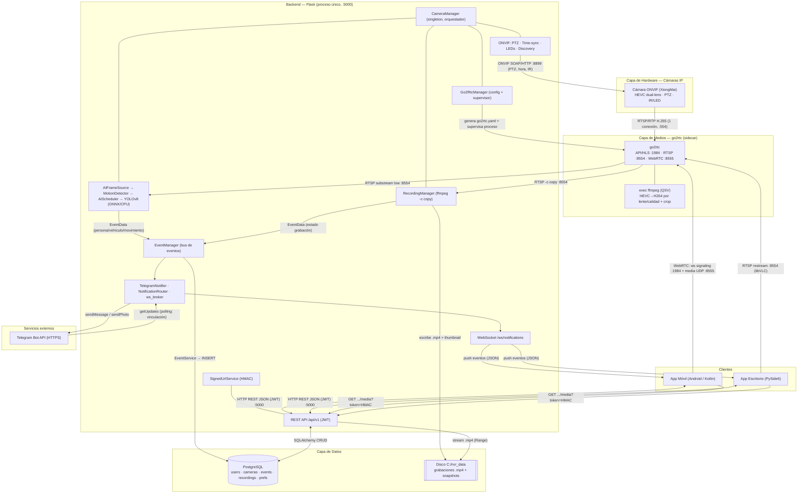
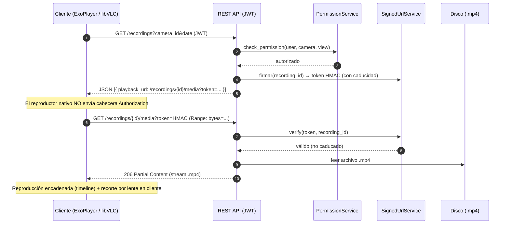
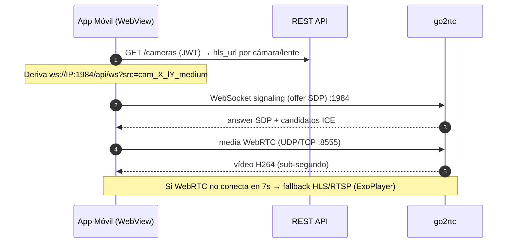

# Arquitectura — Ecosistema de Videovigilancia LAN (NVR/VMS)

> Documento técnico de alto nivel. Refleja el estado **actual** del sistema: diseño
> centrado en **go2rtc** como capa única de medios; la IA y la grabación consumen del
> restream de go2rtc (no de un pipeline FFmpeg propio). El backend Flask es
> **mono-proceso** por diseño (estado en singletons en memoria).

Componentes principales:

- **Backend** Flask (gestión ONVIF, orquestación, API REST/WS, IA, grabación).
- **App Móvil** (Android / Kotlin) — cliente.
- **App Escritorio** (PySide6) — cliente.
- **go2rtc** — sidecar de medios (capa de streaming).
- **Cámaras IP ONVIF** — hardware de origen (HEVC, dual-lens, PTZ, IR/LED).

---

## 1. Diagrama de Arquitectura (Mermaid.js)



---

## 2. Diagrama de Arquitectura (Markdown / ASCII)

```text
┌──────────────────────────────────────────────────────────────────────────────┐
│ CAPA DE HARDWARE                                                               │
│   ┌────────────────────────────┐                                              │
│   │  Cámara IP ONVIF (HEVC)     │   PTZ / hora / IR  ◄── ONVIF SOAP :8899 ─────┼──┐
│   │  dual-lens · PTZ · IR/LED   │   ── RTSP/RTP H.265 :554 ───►                │  │
│   └────────────┬───────────────┘                                              │  │
└────────────────┼──────────────────────────────────────────────────────────────┘  │
                 │ (1 sola conexión RTSP)                                            │
                 ▼                                                                    │
┌──────────────────────────────────────────────────────────────────────────────┐  │
│ CAPA DE MEDIOS — go2rtc (sidecar)                                              │  │
│   API/HLS :1984   ·   RTSP :8554   ·   WebRTC :8555                            │  │
│   exec ffmpeg (QSV): HEVC→H264, crop por lente (l1/l2), escalas (medium/low)  │  │
└───┬───────────────┬───────────────────────────────────┬──────────────────────┘  │
    │ RTSP low       │ RTSP -c copy                       │ WebRTC / RTSP / HLS     │
    ▼                ▼                                     ▼ (a clientes)           │
┌──────────────────────────────────────────────────────────────────────────────┐  │
│ BACKEND — Flask (PROCESO ÚNICO, threaded, :5000)                              │  │
│   ┌──────────────┐  ┌──────────────────────────┐  ┌────────────────────────┐  │  │
│   │ AIFrameSource│  │ RecordingManager         │  │ Go2RtcManager ─────────┼──┼──┘ (genera/supervisa)
│   │ + Motion     │  │ (ffmpeg -c copy → .mp4)  │  │ ONVIF (PTZ/time/LED) ──┼──┘ (controla cámara)
│   │ + AIScheduler│  └───────────┬──────────────┘  └────────────────────────┘  │
│   │ + YOLOv8     │              │ .mp4 + thumb                                  │
│   └──────┬───────┘              ▼                                              │
│          │ EventData     [ Disco C:/nvr_data ]                                 │
│          ▼                                                                     │
│   ┌──────────────── EventManager (bus de eventos) ───────────────┐            │
│   │  → EventService (INSERT)   → TelegramNotifier   → ws_broker   │            │
│   └──────┬───────────────────────────┬──────────────────┬────────┘            │
│          │ SQLAlchemy                 │ HTTPS            │ WS push             │
│   ┌──────▼───────┐            ┌───────▼──────┐   ┌───────▼────────┐            │
│   │ REST /api/v1 │            │ Telegram API │   │ /ws/notifications            │
│   │ (JWT + HMAC) │            └──────────────┘   └───────┬────────┘            │
│   └──────┬───────┘                                       │                     │
└──────────┼──────────────────────────────────────────────┼─────────────────────┘
           │ HTTP REST JSON (JWT)      ┌────────────────────┘ push eventos (JSON)
           │  + media?token=HMAC       │
   ┌───────▼────────────┐     ┌────────▼───────────────┐
   │ CAPA DE DATOS       │     │ CAPA DE CLIENTES        │
   │  PostgreSQL         │     │  • App Móvil (Kotlin)   │  live: WebRTC :1984/:8555
   │  (SQLAlchemy 2.0)   │     │  • App Escritorio (Qt)  │  live: RTSP :8554 (VLC)
   └─────────────────────┘     └─────────────────────────┘
```

**Jerarquía por capas y protocolos (lista anidada):**

- **Capa de Hardware (origen)**
  - Cámara IP ONVIF (HEVC, dual-lens, PTZ, IR/LED)
    - ↑ *Control*: ONVIF SOAP/HTTP (`:8899`) — PTZ, sincronización horaria, IR-Cut, discovery (WS-Discovery `:3702`)
    - ↓ *Vídeo*: RTSP/RTP, códec H.265 (`:554`) — una única conexión consumida por go2rtc
- **Capa de Medios (sidecar go2rtc)**
  - Ingesta única RTSP → re-publicación multiprotocolo
    - WebRTC (signaling WS `:1984/api/ws` + media UDP/TCP `:8555`) → clientes
    - RTSP restream (`:8554`) → desktop (VLC) + consumidores internos
    - HLS (`:1984/api/stream.m3u8`) → fallback móvil
    - Transcodes `exec ffmpeg` (QSV): crop por lente + escalas de calidad
- **Capa de Backend (Flask, proceso único)**
  - *Borde / API*: REST `/api/v1` (JWT), WebSocket `/ws/notifications`, URLs firmadas (HMAC)
  - *Orquestación*: `CameraManager` (singleton)
  - *Medios*: `Go2RtcManager` (config + supervisor)
  - *Visión*: `AIFrameSource` → `MotionDetector` → `AIScheduler` → `YOLOv8` (ONNX/CPU)
  - *Grabación*: `RecordingManager` (`ffmpeg -c copy`) + `StorageManager`/`ConsistencyChecker`
  - *Eventos*: `EventManager` (bus) → `EventService`, `TelegramNotifier`, `NotificationRouter`, `ws_broker`
  - *Control de cámara*: `ptz_controller`, `time_sync`, `led_controller`, `onvif_discovery`
- **Capa de Datos**
  - PostgreSQL (SQLAlchemy 2.0): `users`, `cameras`, `user_camera_permissions`, `events`, `recordings`, `notification_preferences`, `mobile_devices`, `user_telegram_chats`
  - Sistema de archivos: grabaciones `.mp4` + snapshots (`C:/nvr_data`)
- **Servicios externos**
  - Telegram Bot API (HTTPS): `sendMessage`/`sendPhoto` (salida) + `getUpdates` (polling de vinculación)
- **Capa de Clientes**
  - App Móvil (Android/Kotlin): REST+JWT, WebRTC (WebView), WS notificaciones, reproducción VOD firmada
  - App Escritorio (PySide6): REST+JWT, live por RTSP (libVLC), gestión ONVIF, reproducción VOD firmada

---

## 3. Definición de Módulos y Entradas/Salidas (I/O)

### 3.1 Cámaras (Hardware de origen)

| Módulo / Componente | Responsabilidad Principal | Entradas (Inputs) | Salidas (Outputs) |
|---|---|---|---|
| Servicio RTSP de la cámara | Emitir el vídeo en vivo codificado | Petición `DESCRIBE/SETUP/PLAY` RTSP desde go2rtc (`:554`) | Stream **RTP/RTSP H.265** (dual-lens combinado) → go2rtc |
| Servicio ONVIF (`device_service`) | Exponer control y metadatos del dispositivo | Peticiones **SOAP/XML sobre HTTP** del backend (`:8899`): PTZ `ContinuousMove`, `SetSystemDateAndTime`, imaging/IR | Respuestas SOAP (perfiles, capacidades, ACK de movimiento) → backend |
| WS-Discovery | Anunciar presencia en la red | Probe multicast del backend (`:3702`) | `ProbeMatch` con XAddrs (URL ONVIF) → backend |

### 3.2 Backend Flask

| Módulo / Componente | Responsabilidad Principal | Entradas (Inputs) | Salidas (Outputs) |
|---|---|---|---|
| **REST API** (`/api/v1`) | Punto de control autenticado (CRUD, comandos, VOD) | HTTP **JSON + JWT** de clientes; `token` HMAC en peticiones de medios | Respuestas JSON; streams `.mp4` con `Range`; códigos de error |
| **Go2RtcManager** | Ciclo de vida del sidecar de medios | Lista de cámaras (BD); estado del proceso go2rtc | `go2rtc.generated.yaml`; arranque/supervisión/reconcile del proceso |
| **CameraManager** (singleton) | Orquestar arranque/parada de cámaras y subsistemas | Eventos de activación; config de cámara (BD) | Inicia AIFrameSource, RecordingManager, ONVIF time-sync por cámara |
| **ONVIF (PTZ/Time/LED/Discovery)** | Control del hardware | Comandos REST (dirección PTZ, estado LED); IP/credenciales | Llamadas **SOAP** a la cámara; resultado de discovery (JSON) |
| **AIFrameSource → Motion → AIScheduler → YOLOv8** | Detección de objetos gateada por movimiento | **RTSP substream `low`** de go2rtc (640×384 @4fps) | `EventData` (persona/vehículo/movimiento) → EventManager; snapshot JPEG |
| **RecordingManager** | Grabación continua/evento | **RTSP** de go2rtc (`-c copy`, sin recodificar) | Archivos `.mp4` + thumbnail en disco; `EventData` de estado |
| **EventManager** (bus) | Distribuir eventos a suscriptores | `EventData` de workers (AI, grabación, ONVIF) | Despacho a EventService, TelegramNotifier, NotificationRouter, ws_broker, MetricsCollector |
| **EventService** | Persistencia de eventos | `EventData` del bus | `INSERT` en `events` (PostgreSQL) |
| **TelegramNotifier / bot_poller** | Alertas y vinculación por Telegram | Eventos del bus; `getUpdates` (polling) | **HTTPS** `sendMessage/sendPhoto`; vinculación de chats (BD) |
| **ws_broker** (`/ws/notifications`) | Push de eventos en tiempo real | Eventos del bus; conexión WS del cliente (JWT en query) | Mensajes **JSON** por WebSocket → móvil/desktop |
| **SignedUrlService** | Autorizar medios sin cabecera Authorization | `recording_id` + permiso del usuario | **Token HMAC** con caducidad embebido en la URL de medios |
| **PermissionService** | Control de acceso multi-tenant | `user_id`, `camera_id`, acción | Booleano de autorización (view/control/PTZ…) |
| **Capa de datos** (`DatabaseManager` + repos) | Acceso a PostgreSQL | Consultas de servicios/rutas | Entidades ORM (SQLAlchemy 2.0); pool de conexiones |

### 3.3 Aplicación Móvil (Android / Kotlin)

| Módulo / Componente | Responsabilidad Principal | Entradas (Inputs) | Salidas (Outputs) |
|---|---|---|---|
| `QrScanFragment` + `RetrofitClient` | Onboarding y sesión (JWT + refresh) | QR (`server`+`link_token`) o IP/usuario/clave; respuestas auth | `POST /devices/register`, `/auth/login`; tokens persistidos |
| `ApiService` (Retrofit/OkHttp) | Contrato REST con el backend | Llamadas tipadas (cámaras, PTZ, grabaciones, prefs) | HTTP **JSON + JWT** → backend; DTOs deserializados |
| `LiveViewFragment` | Directo de baja latencia | URL derivada del `hls_url`; toques PTZ | **WebRTC** (WebView → go2rtc `:1984/:8555`); fallback HLS/RTSP (ExoPlayer); `POST .../ptz/{dir}` |
| `CameraListFragment` | Rejilla de previsualización | Lista de cámaras (REST) | Reproducción ExoPlayer (substream `medium` go2rtc) |
| `RecordingsHostFragment` / `PlaybackFragment` | Reproducción VOD (pestañas lente/eventos, timeline) | `GET /recordings?camera_id&date`; `playback_url` firmada | Reproducción encadenada (ExoPlayer); recorte por lente (TextureView+matriz) |
| `NotificationsPanelFragment` + `NotificationWebSocketService` | Alertas en vivo e historial | WS `/ws/notifications`; `GET /mobile/notifications/history` | Lista de eventos; navegación a la grabación del evento |
| `TelegramLinkFragment` | Vinculación de Telegram | `POST /telegram/generate-code`; polling de estado | Deep link a Telegram; estado de vinculación |

### 3.4 Aplicación de Escritorio (PySide6)

| Módulo / Componente | Responsabilidad Principal | Entradas (Inputs) | Salidas (Outputs) |
|---|---|---|---|
| `login_view` + `api_client` | Sesión y cliente REST asíncrono (JWT + refresh) | Credenciales; respuestas auth | HTTP **JSON + JWT** → backend; tokens en memoria |
| `live_view` | Directo multi-cámara | URLs de restream go2rtc (calidad `medium`) | Reproducción **RTSP** vía libVLC (`:8554`) |
| `camera_management_view` | Alta/edición/descubrimiento ONVIF + preview | `POST /cameras/discover`, CRUD `/cameras`, `test-connection` | Cámaras creadas/editadas; preferencias de notificación por cámara |
| `playback_view` | Reproducción de grabaciones | `GET /recordings/...`; `playback_url` firmada | Reproducción VOD (libVLC); recorte por lente (crop cliente) |
| `notifications_view` | Preferencias, Telegram y resumen admin | `/notifications/preferences`, `/telegram/*`, `/ai/status` | CRUD de preferencias `(event_type, camera_id, enabled)` |
| `settings_view` | Configuración de sistema/almacenamiento/IA | `GET /system/config`, `/storage/info` | `POST /storage/config`, `/system/config` (cuota, ruta, IA) |
| `dashboard_view` | Estado general del sistema | `/system/health`, `/storage/info` | Indicadores de salud (cámaras, almacenamiento) |

---

## 4. Diagramas de Secuencia (Mermaid.js)

### 4.1 Detección de IA → Notificación multicanal

```mermaid
sequenceDiagram
    autonumber
    participant CAM as Cámara ONVIF
    participant G2R as go2rtc
    participant AI as AIFrameSource + YOLOv8
    participant BUS as EventManager
    participant DB as PostgreSQL
    participant TG as Telegram API
    participant WS as ws_broker
    participant CLI as Cliente (móvil/desktop)

    CAM->>G2R: RTSP/RTP H.265 (ingesta única)
    G2R->>AI: RTSP substream low (640x384 @4fps)
    AI->>AI: MotionDetector gatea → YOLOv8 (ONNX/CPU)
    Note over AI: Detección (persona/vehículo) + cooldown por clase
    AI->>BUS: publish(EventData) + snapshot JPEG
    par Persistencia
        BUS->>DB: EventService → INSERT events
    and Telegram
        BUS->>TG: sendPhoto/sendMessage (según prefs + permisos)
    and Push tiempo real
        BUS->>WS: dispatch evento
        WS-->>CLI: WebSocket JSON (alerta)
    end
    CLI->>CLI: Muestra alerta; al tocar → abre grabación del evento
```

### 4.2 Reproducción de grabación con URL firmada (VOD)



### 4.3 Directo de baja latencia (WebRTC, móvil)



---

## 5. Notas arquitectónicas relevantes

- **Restricción nuclear:** el backend es **mono-proceso** por diseño — casi todo el estado vive en singletons en memoria (`CameraManager`, `EventManager`, `Go2RtcManager`, pools). No es escalable horizontalmente sin externalizar estado (Redis/DB).
- **go2rtc como punto único de ingesta:** garantiza **una sola conexión RTSP** por cámara (requisito del hardware) y desacopla a los clientes del códec de origen (HEVC) re-publicando H264 vía WebRTC para compatibilidad de navegador/WebView.
- **Separación control vs. medios:** el control y los metadatos viajan por **REST/JWT** al backend (`:5000`); el vídeo en vivo va **directo cliente↔go2rtc**, sin re-encodear en el backend (clave para la latencia y la carga).
- **Seguridad de medios:** la reproducción VOD usa **URLs firmadas HMAC** con caducidad, evitando exponer el JWT a reproductores nativos.
- **Cámaras dual-lens:** un único stream combinado (side-by-side/apilado) se recorta por lente — en el directo, vía transcodes `exec` de go2rtc (`l1`/`l2`); en la reproducción VOD, en el **cliente** (matriz sobre TextureView en móvil; crop en libVLC en desktop), sin coste de servidor.
```
