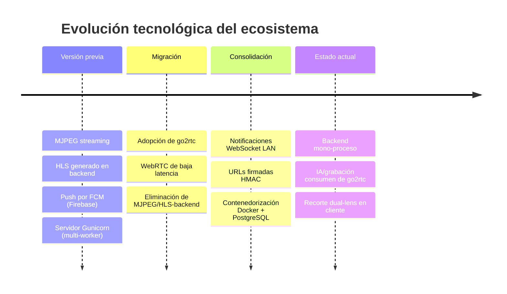
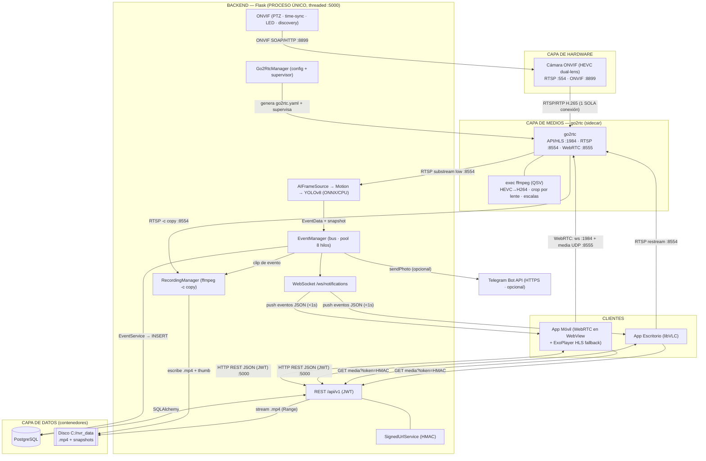
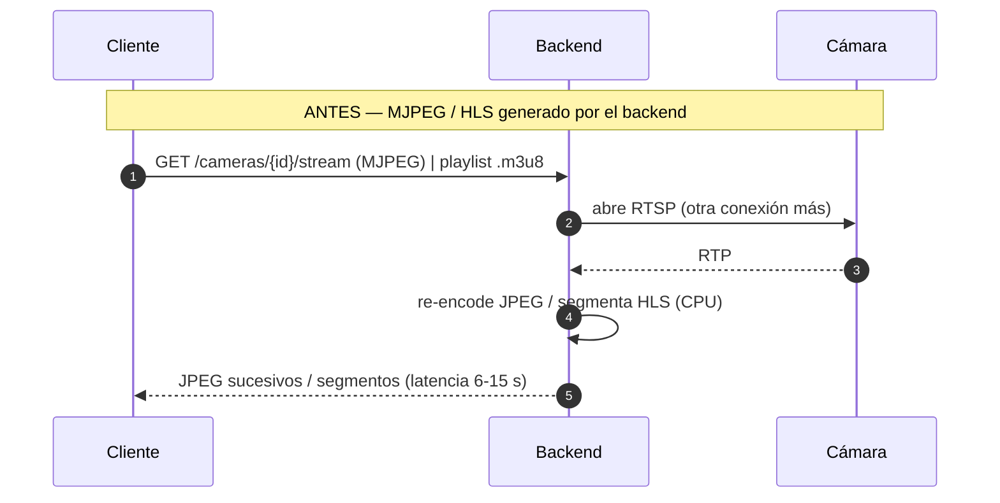
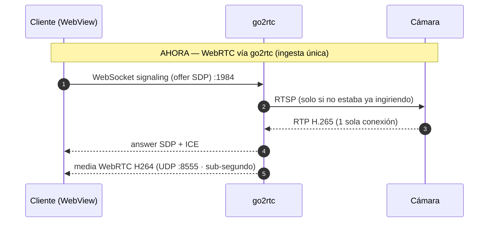
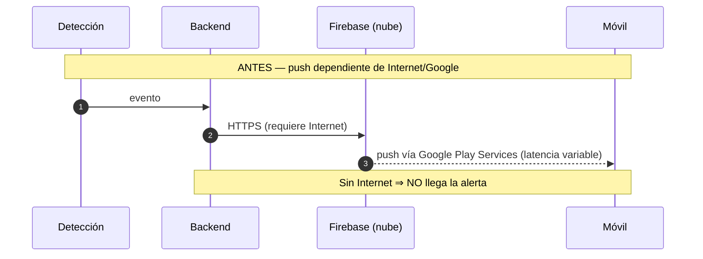
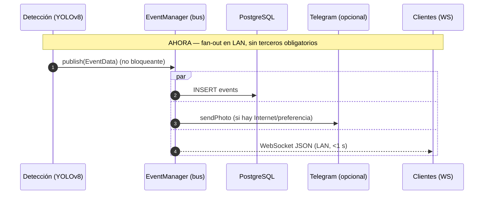
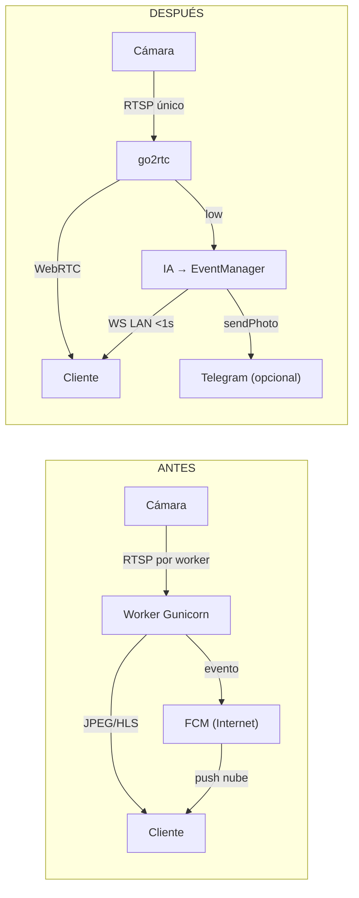

# Comparativa Tecnológica y Justificación de la Migración

> **Propósito.** Documentar la evolución tecnológica del ecosistema de
> videovigilancia entre la versión **previa a la migración** y la versión
> **actual**, justificando cada cambio de tecnología desde criterios de
> ingeniería (latencia, ancho de banda, concurrencia, dependencias externas,
> seguridad y operabilidad).
>
> **Metodología.** La comparación se realizó sobre el historial Git, tomando como
> línea base el commit `4f8fcd8` ("n", inmediatamente anterior al commit
> `c322962 "Migración"`) y como destino el estado actual del repositorio. El
> conjunto de altas/bajas de tecnología se obtuvo con `git diff --diff-filter`
> sobre los manifiestos de dependencias y los módulos de código.
>
> **Nota sobre las cifras.** Los valores cuantitativos de las tablas comparativas
> son **representativos (orden de magnitud)** de cada clase de tecnología, usados
> para ilustrar la justificación del cambio; no son mediciones de laboratorio del
> sistema. Las diferencias cualitativas (qué tecnología sustituye a cuál y por
> qué) sí están verificadas contra el código.

---

## 1. Resumen Ejecutivo

La migración transformó el sistema de un **diseño de streaming clásico (MJPEG +
HLS generado por el backend) con notificaciones dependientes de la nube (FCM) y
servidor multi-proceso (Gunicorn)** a una **arquitectura de medios moderna
centrada en go2rtc (WebRTC de baja latencia), notificaciones LAN en tiempo real
(WebSocket) y un backend mono-proceso contenedorizado (Docker + PostgreSQL)**.

| # | Dominio | Antes | Ahora | Naturaleza |
|---|---|---|---|---|
| 1 | Streaming en vivo | MJPEG + HLS en backend | **go2rtc** (WebRTC/RTSP/HLS) | Reemplazo de núcleo |
| 2 | Reproducción móvil | Solo RTSP/MJPEG | **WebRTC (WebView) + ExoPlayer HLS** | Modernización |
| 3 | Reproducción escritorio | `video_streamer` propio | **VLC / libVLC** | Reemplazo |
| 4 | Notificaciones push | **FCM (Firebase)** | **WebSocket LAN + Telegram** | Reemplazo |
| 5 | Modelo de servidor | **Gunicorn** multi-worker | **Flask proceso único** (threaded) | Reemplazo |
| 6 | Empaquetado/despliegue | Instalación manual | **Docker + Docker Compose** | Alta |
| 7 | Base de datos | PostgreSQL no formalizado | **PostgreSQL en contenedor** + `psycopg2` + Alembic | Formalización |
| 8 | Seguridad de medios | Acceso directo al fichero | **URLs firmadas HMAC** | Alta |
| 9 | Pipeline interno de IA | `FrameDistributor` + `InferenceQueue` | **Consumidores de go2rtc** (`AIFrameSource`) | Reemplazo (en curso) |

---

## 2. Línea de Tiempo de la Migración

---

## 3. Arquitectura — ANTES (previa a la migración)

> **Resumen.** Servidor **Flask servido por Gunicorn con varios *workers***
> (multi-proceso). El vídeo en vivo se entregaba con **MJPEG** (un endpoint
> `/cameras/{id}/stream` que emitía JPEG sucesivos) y con **HLS generado por el
> propio backend** (`live_hls_service`). El análisis usaba un pipeline de frames
> en proceso: **`FFmpegWorker → CircularFrameBuffer → FrameDistributor →
> InferenceQueue`**, con un **`dual_lens_splitter`** en Python para separar
> lentes. Las alertas push viajaban por **FCM (Firebase)**. El escritorio
> decodificaba con un **`video_streamer`** propio.

### 3.1 Diagrama de componentes (ANTES)

```mermaid
flowchart TD
    subgraph HW0["CAPA DE HARDWARE"]
        CAM0["Cámara IP<br/>(RTSP · H.264/MJPEG)"]
    end

    subgraph SRV0["SERVIDOR — Flask bajo Gunicorn (N procesos worker)"]
        direction TB
        subgraph WK["Workers (estado DUPLICADO por proceso)"]
            W1["Worker 1<br/>CameraManager (copia)"]
            W2["Worker 2<br/>CameraManager (copia)"]
            Wn["Worker N<br/>CameraManager (copia)"]
        end
        FW["FFmpegWorker → CircularFrameBuffer<br/>→ FrameDistributor"]
        DLS["dual_lens_splitter (Python)"]
        IQ["InferenceQueue → YOLOv8"]
        MJPEG["mjpeg_streamer<br/>GET /cameras/&#123;id&#125;/stream"]
        HLSB["live_hls_service<br/>(segmenta HLS en el backend)"]
        FCMN["fcm_notifier"]
    end

    subgraph CLOUD0["NUBE (TERCEROS)"]
        FCM["Firebase Cloud Messaging"]
    end

    subgraph CLI0["CLIENTES"]
        DESK0["Escritorio<br/>video_streamer (decode propio)"]
        MOB0["Móvil"]
    end

    DBX[("PostgreSQL / SQLite<br/>(no formalizado)")]

    CAM0 -->|"RTSP/RTP (1 conexión POR worker)"| W1
    CAM0 -->|"RTSP/RTP"| W2
    CAM0 -->|"RTSP/RTP"| Wn
    W1 --> FW
    FW --> DLS
    FW --> IQ
    W1 --> MJPEG
    W2 --> HLSB
    MJPEG -->|"MJPEG · JPEG sucesivos<br/>(alto BW · sin audio · polling)"| DESK0
    HLSB -->|"HLS · segmentos<br/>(latencia 6-15 s)"| MOB0
    IQ -->|"evento de detección"| FCMN
    FCMN -->|"HTTPS (requiere Internet)"| FCM
    FCM -->|"push vía Google Play Services"| MOB0
    DESK0 -->|"HTTP REST (JWT)"| W2
    MOB0 -->|"HTTP REST (JWT)"| Wn
    WK <-->|"SQLAlchemy"| DBX
```

### 3.2 Problemas estructurales de la arquitectura antigua

| Síntoma | Causa raíz | Consecuencia |
|---|---|---|
| Cámara "rechaza conexión" / cuelga | **Gunicorn multi-worker**: cada proceso abría su **propia** sesión RTSP y su propio FFmpeg | Se **excede el límite de 1–2 sesiones RTSP** del hardware; estado inconsistente entre workers |
| Consumo de red elevado | **MJPEG** sin compresión inter-frame (cada fotograma = JPEG completo) | ~8–12 Mbps por espectador a 720p; **sin audio**; latencia por *polling* |
| Directo "va con retraso" | **HLS generado en el backend** (segmentación en *chunks*) | **6–15 s** de latencia intrínseca + carga de CPU de segmentación en Flask |
| Alertas no llegan sin Internet | **FCM** depende de **Internet + Google Play Services** | Inútil en instalación **LAN aislada**; metadatos del evento pasan por un **tercero** |
| Mantenimiento frágil del vídeo | Decodificador **propio** (`video_streamer`) + `dual_lens_splitter` en Python | Mucho código propio sensible a códecs/cámaras; CPU extra por el split en Python |

---

## 4. Arquitectura — DESPUÉS (actual)

> **Resumen.** Una **única ingesta RTSP** por cámara la realiza **go2rtc**
> (sidecar), que re-publica el vídeo a los clientes por **WebRTC** (sub-segundo),
> **RTSP** y **HLS**, sin re-encodear en Flask. El backend corre como **un solo
> proceso** (Flask *threaded*); la IA y la grabación **consumen de go2rtc**. Las
> alertas se distribuyen por un **bus de eventos** a PostgreSQL, **WebSocket LAN**
> y **Telegram**. Todo el conjunto se empaqueta con **Docker** y la reproducción
> VOD se protege con **URLs firmadas HMAC**.

### 4.1 Diagrama de componentes (DESPUÉS)

### 4.2 Ventajas estructurales de la arquitectura nueva

| Problema antiguo | Solución nueva | Beneficio |
|---|---|---|
| N conexiones RTSP por cámara | go2rtc ingiere **una sola vez** y hace *fan-out* | Respeta el límite del hardware; sin saturar la cámara |
| Estado duplicado entre workers | **Backend mono-proceso** + *singletons* | Estado **coherente**; sin FFmpeg duplicados |
| Latencia 6–15 s (HLS/MJPEG) | **WebRTC** | Directo **sub-segundo**, compatible con WebView/navegador |
| CPU de medios en Flask | Medios **fuera del proceso** (go2rtc + QSV) | Flask libre para API/lógica; transcode acelerado por iGPU |
| Dependencia de la nube (FCM) | **WebSocket LAN** + Telegram opcional | Funciona **sin Internet**, sin terceros, < 1 s |
| Acceso a medios sin control fino | **URLs firmadas HMAC** con caducidad | VOD seguro sin exponer el JWT a los reproductores |
| Despliegue manual frágil | **Docker + Compose** (FFmpeg/go2rtc embebidos) | Despliegue **reproducible** y portable |

### 4.3 Diagramas de Secuencia Comparativos

#### (a) Directo en vivo — ANTES (MJPEG/HLS) vs AHORA (WebRTC)

#### (b) Alerta de evento — ANTES (FCM) vs AHORA (WebSocket LAN)

---

## 5. Comparativa por Dominio (Antes → Ahora)

### 5.1 Capa de Streaming en Vivo — MJPEG/HLS-backend → **go2rtc (WebRTC)**

| Criterio | Antes (MJPEG / HLS-backend) | Ahora (go2rtc / WebRTC) |
|---|---|---|
| Latencia del directo | ~6–15 s (HLS) / *polling* (MJPEG) | **~0.3–1 s** (WebRTC) |
| Ancho de banda (≈720p, por cliente) | ~8–12 Mbps (MJPEG) | **~1–2 Mbps** (H.264) |
| Compresión | Intra-frame (JPEG por fotograma) | **Inter-frame** (H.264/H.265) |
| Conexiones a la cámara | 1 por consumidor (riesgo de saturación) | **1 única** (fan-out) |
| Audio | No | Sí (WebRTC) |
| Carga de CPU en backend | Alta (encode JPEG / segmentar) | **Baja** (go2rtc + QSV; sin re-encode en Flask) |

> **Justificación.** MJPEG es simple pero inviable a escala: sin compresión
> temporal, multiplica el ancho de banda y la CPU, y obliga a una conexión por
> espectador. El HLS generado por el backend reducía banda pero introducía
> **segundos** de latencia y carga de segmentación. **go2rtc + WebRTC** resuelve
> ambos: una ingesta única, latencia sub-segundo y descarga del trabajo de medios
> fuera del proceso Flask.

### 5.2 Reproducción en Clientes — propio/JPEG → **VLC + ExoPlayer (HLS/WebRTC)**

| Plataforma | Antes | Ahora | Motivo |
|---|---|---|---|
| Escritorio | `video_streamer.py` (decodificación propia) | **libVLC** (`rtsp_video.py`) | Decodificación nativa robusta, HW accel, menos código propio |
| Móvil | RTSP/MJPEG en ExoPlayer | **WebRTC (WebView)** + **ExoPlayer HLS** fallback | Latencia sub-segundo; HLS como red de seguridad |

> **Justificación.** Mantener un decodificador propio es costoso y frágil frente a
> la variedad de cámaras y códecs. Delegar en **libVLC** (escritorio) y en el
> stack **WebRTC/ExoPlayer** (móvil) aporta fiabilidad, aceleración por hardware y
> menor superficie de mantenimiento.

### 5.3 Notificaciones Push — **FCM (Firebase)** → **WebSocket LAN + Telegram**

| Criterio | Antes (FCM) | Ahora (WebSocket + Telegram) |
|---|---|---|
| Dependencia de Internet | **Obligatoria** | **No** (WebSocket es LAN) |
| Dependencia de terceros | Google Play Services | Ninguna (WS) / Telegram opcional |
| Latencia de alerta | Variable (nube) | **< 1 s** (LAN) |
| Privacidad de metadatos | Pasan por Google | **Permanecen en la LAN** |
| Gestión de tokens | Tokens FCM por dispositivo | Sesión WS autenticada por JWT |

> **Justificación.** El sistema es un **appliance LAN** que puede operar **sin
> Internet**. FCM lo hacía dependiente de la nube y de Google, con latencia
> variable y exposición de metadatos a un tercero. El canal **WebSocket
> `/ws/notifications`** entrega alertas en tiempo real dentro de la red local, y
> **Telegram** queda como canal externo **opcional** para avisos fuera de casa.

### 5.4 Modelo de Ejecución del Servidor — **Gunicorn** → **Flask proceso único**

| Criterio | Antes (Gunicorn, N workers) | Ahora (Flask `app.run`, threaded) |
|---|---|---|
| Procesos | N (uno por worker) | **1** |
| Estado en memoria | Duplicado e inconsistente | **Único y coherente** (singletons) |
| Conexiones RTSP por cámara | N (una por worker) | **1** |
| Subprocesos FFmpeg | Duplicados | **Sin duplicar** |
| Idoneidad para appliance LAN | Baja | **Alta** |

> **Justificación.** El diseño depende de *singletons* que sostienen hilos,
> subprocesos FFmpeg, *buffers* y *pools* en memoria. Bajo Gunicorn multi-worker
> ese estado se **multiplica**: cada worker abriría su propia conexión a la cámara
> (rompiendo el límite de sesiones RTSP) y mantendría su propia copia del estado.
> Un **único proceso** con *pool* de hilos es la topología correcta para este
> appliance, y elimina toda una clase de errores de coherencia.

### 5.5 Empaquetado y Despliegue — manual → **Docker + Compose + PostgreSQL**

| Criterio | Antes | Ahora |
|---|---|---|
| Instalación | Manual (Python, FFmpeg, go2rtc, BD…) | **`docker compose up -d`** |
| Reproducibilidad | Dependiente del equipo | **Imagen versionada** |
| go2rtc / FFmpeg | A cargo del usuario | **Embebidos en la imagen** (go2rtc `v1.9.9`, FFmpeg apt) |
| Base de datos | Configuración ad-hoc | **Contenedor PostgreSQL** + `psycopg2` + Alembic |
| Init / *reaping* | — | **tini** como PID 1 (gestiona FFmpeg/go2rtc) |

> **Justificación.** Empaquetar el backend con sus binarios de medios (FFmpeg y
> go2rtc) y la base de datos en contenedores hace el despliegue **reproducible** y
> **portable** (Docker Desktop/Windows y Linux), elimina la instalación manual de
> dependencias y formaliza PostgreSQL con migraciones versionadas (Alembic).

### 5.6 Seguridad de Medios — acceso directo → **URLs firmadas HMAC**

| Criterio | Antes | Ahora (SignedUrlService) |
|---|---|---|
| Autorización de reproducción | Acceso directo / JWT en cabecera | **Token HMAC** con caducidad en la URL |
| Compatibilidad con reproductores nativos | Limitada (no envían `Authorization`) | **Total** (token en *query string*) |
| Exposición de credenciales | JWT viajaba al reproductor | El JWT **no** se expone al reproductor |

> **Justificación.** Los reproductores nativos (ExoPlayer, libVLC) no envían la
> cabecera `Authorization`. Las **URLs firmadas con HMAC y caducidad** permiten
> servir VOD de forma segura sin exponer el JWT, manteniendo el control de acceso
> por cámara/usuario.

### 5.7 Pipeline Interno de IA — `FrameDistributor`/`InferenceQueue` → **consumidores de go2rtc** *(en curso)*

| Criterio | Antes | Ahora |
|---|---|---|
| Origen de frames para IA | `FFmpegWorker` → `CircularFrameBuffer` → `FrameDistributor` | **`AIFrameSource`** (substream *low* de go2rtc) |
| Cola de inferencia | `InferenceQueue` dedicada | Worker que lee *slot* (newest-wins) |
| Split dual-lens | `dual_lens_splitter.py` (en Python) | **go2rtc** (servidor) / **cliente** |

> **Justificación.** Centralizar la ingesta en go2rtc hace redundante el pipeline
> de distribución de frames en proceso. La IA y la grabación pasan a **consumir
> del mismo origen** (go2rtc), simplificando el código, evitando una segunda
> conexión a la cámara y moviendo el recorte dual-lens a donde es más barato
> (servidor para el directo, cliente para la reproducción).

---

## 6. Tabla Consolidada de Métricas (representativas)

| Métrica | Versión previa | Versión actual | Mejora |
|---|---|---|---|
| Latencia del directo | ~6–15 s | ~0.3–1 s | **~10–20×** |
| Ancho de banda por cliente (720p) | ~8–12 Mbps | ~1–2 Mbps | **~6–8×** |
| Conexiones RTSP por cámara | N (1 por consumidor/worker) | 1 | **N→1** |
| Procesos del backend | N (workers) | 1 | Coherencia de estado |
| Funcionamiento sin Internet | No (FCM) | **Sí** (WS LAN) | Operación aislada |
| Pasos de despliegue | Manuales (múltiples) | 1 (`docker compose up`) | Reproducibilidad |
| Exposición de metadatos a terceros | Sí (FCM/Google) | No | Privacidad |

> *Valores representativos del orden de magnitud típico de cada tecnología, para
> ilustrar la justificación del cambio.*

---

## 7. Flujo de Datos — Antes vs Después (alerta de evento)

---

## 8. Conclusiones

La migración no fue un cambio de *librerías* (el stack de Python y Android se
mantuvo), sino un **cambio de paradigma arquitectónico** en la capa de medios,
notificaciones y despliegue:

1. **De clásico a tiempo real:** MJPEG/HLS-backend → **WebRTC** (latencia
   sub-segundo, menor ancho de banda).
2. **De dependiente de la nube a autónomo en LAN:** FCM → **WebSocket** (opera sin
   Internet, sin terceros).
3. **De multi-proceso frágil a mono-proceso coherente:** Gunicorn → **Flask
   single-process**, alineado con el diseño de *singletons*.
4. **De instalación manual a despliegue reproducible:** **Docker + Compose +
   PostgreSQL** con binarios de medios embebidos.
5. **Seguridad de medios reforzada:** **URLs firmadas HMAC** para VOD.

En conjunto, el sistema pasó de un prototipo funcional a una **arquitectura de
appliance LAN** coherente, de baja latencia, segura y reproducible.

---

*Documentos relacionados:* [`ARQUITECTURA.md`](ARQUITECTURA.md) ·
[`STACK_TECNOLOGICO.md`](STACK_TECNOLOGICO.md) · [`PIPELINE_FRAME.md`](PIPELINE_FRAME.md)
