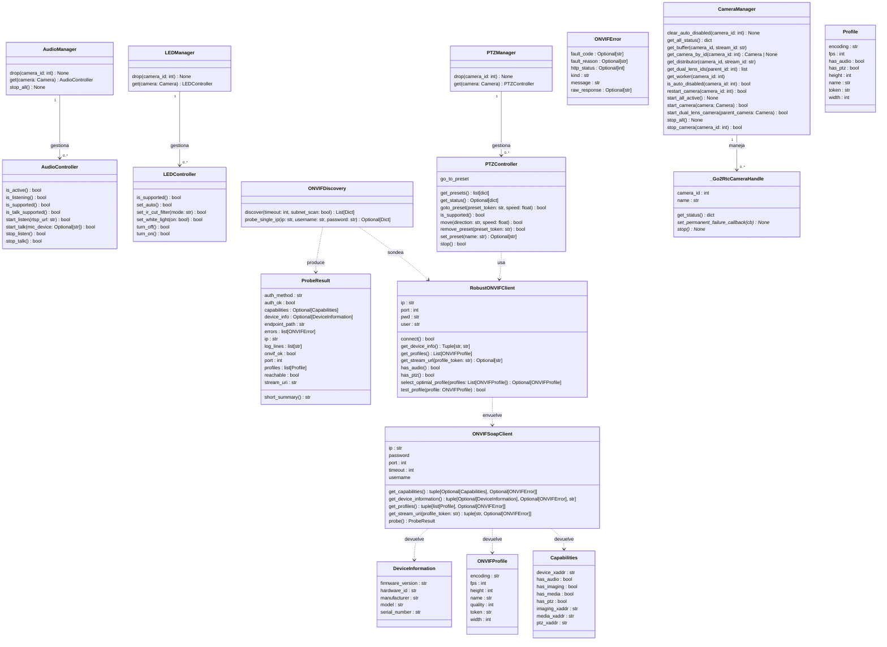
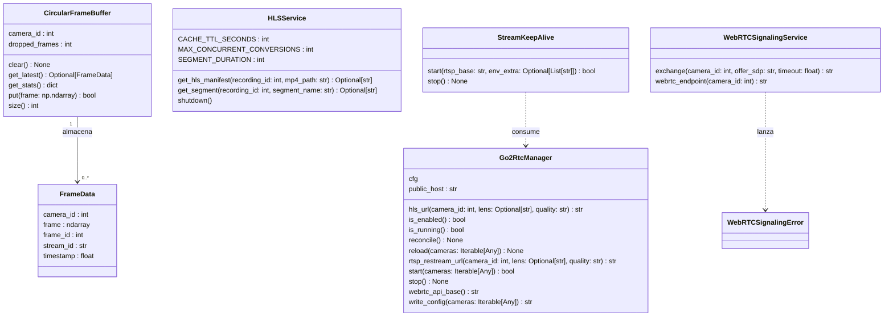
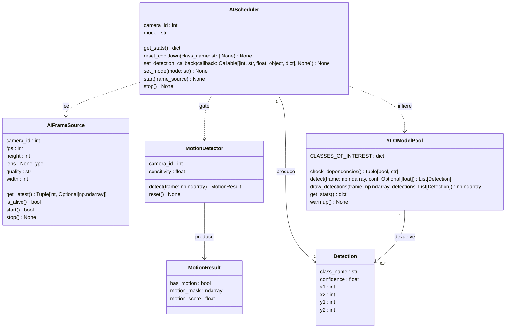

# Diagrama de Clases (por módulo) — Sistema de Videovigilancia

> Un **diagrama de clases en Mermaid por módulo** del backend. Las **clases,
> atributos y métodos** se extrajeron automáticamente del código con **pyreverse**
> (`pylint`); las **relaciones (asociaciones/dependencias con cardinalidad)** se
> añadieron manualmente, porque pyreverse solo dibuja herencia y no infiere las
> asociaciones declaradas como `Mapped[List['X']]` (SQLAlchemy) ni el cableado por
> contenedor de dependencias / bus de eventos (que ocurre en runtime).
>
> Renderiza cualquier bloque en [mermaid.live](https://mermaid.live) (exporta
> PNG/SVG) o con una extensión Mermaid en VS Code. Las imágenes PNG/SVG ya
> generadas están en [`docs/uml/`](uml/).

**Leyenda:** `--|>` herencia · `-->` asociación (con cardinalidad `"1"`/`"0..*"`) ·
`..>` dependencia/uso.

---

## Modelos de datos — `backend/app/database`

Entidades SQLAlchemy y repositorios. Es el modelo de datos central; las relaciones reflejan las claves foráneas (coincide con el ER de `NORMALIZACION_BD.md`). `EventType`/`UserRole` son enums; `DatabaseManager` gestiona la conexión; los `*Repository` heredan de `BaseRepository`.

```mermaid
classDiagram
  class AuditLog {
    action : Mapped[str]
    created_at : Mapped[datetime]
    details : Mapped[Optional[str]]
    id : Mapped[int]
    ip_address : Mapped[Optional[str]]
    resource_id : Mapped[Optional[str]]
    resource_type : Mapped[Optional[str]]
    user_agent : Mapped[Optional[str]]
    user_id : Mapped[Optional[int]]
    to_dict() dict
  }
  class Base {
  }
  class BaseRepository {
    logger : NoneType, RootLogger
    model_class : Type[T]
    create(obj: T) T
    delete(id: int) bool
    get_all() List[T]
    get_by_id(id: int) Optional[T]
    update(obj: T) T
  }
  class Camera {
    connection_type : Mapped[str]
    created_at : Mapped[datetime]
    events : Mapped[List['Event']]
    fallback_url : Mapped[Optional[str]]
    fps : Mapped[int]
    has_ai : Mapped[bool]
    has_audio : Mapped[bool]
    has_leds : Mapped[bool]
    has_ptz : Mapped[bool]
    id : Mapped[int]
    ip_address : Mapped[str]
    is_active : Mapped[bool]
    is_dual_lens : Mapped[bool]
    last_connected_at : Mapped[Optional[datetime]]
    last_error_code : Mapped[Optional[str]]
    name : Mapped[str]
    onvif_url : Mapped[Optional[str]]
    owner : Mapped[Optional['User']]
    owner_id : Mapped[Optional[int]]
    password : Mapped[Optional[str]]
    profile_token : Mapped[Optional[str]]
    recordings : Mapped[List['Recording']]
    resolution_height : Mapped[int]
    resolution_width : Mapped[int]
    rtsp_url : Mapped[str]
    user_permissions : Mapped[List['UserCameraPermission']]
    username : Mapped[Optional[str]]
    to_dict() dict
  }
  class CameraRepository {
    logger : NoneType, RootLogger
    get_active_cameras() List[Camera]
    get_ai_camera() Optional[Camera]
    get_by_ip(ip_address: str) Optional[Camera]
  }
  class DatabaseManager {
    dispose()
    get_engine()
    get_session() Generator[Session, None, None]
    get_session_factory()
    health_check() bool
    init_db()
  }
  class Event {
    acknowledged : Mapped[bool]
    camera : Mapped['Camera']
    camera_id : Mapped[int]
    clip_path : Mapped[Optional[str]]
    confidence : Mapped[float]
    created_at : Mapped[datetime]
    event_type : Mapped[str]
    id : Mapped[int]
    notification_logs : Mapped[List['NotificationLog']]
    snapshot_path : Mapped[Optional[str]]
    to_dict() dict
  }
  class EventRepository {
    logger : NoneType, RootLogger
    acknowledge(event_id: int) bool
    get_by_camera(camera_id: int, limit: int) List[Event]
    get_by_type(event_type: str, limit: int) List[Event]
    get_recent(hours: int, limit: int) List[Event]
    get_unacknowledged() List[Event]
  }
  class EventType {
    name
  }
  class LinkToken {
    created_at : Mapped[datetime]
    expires_at : Mapped[datetime]
    id : Mapped[int]
    token : Mapped[str]
    used : Mapped[bool]
    user_id : Mapped[int]
  }
  class MobileDevice {
    created_at : Mapped[datetime]
    device_name : Mapped[str]
    device_uuid : Mapped[str]
    id : Mapped[int]
    is_active : Mapped[bool]
    last_seen_at : Mapped[datetime]
    platform : Mapped[str]
    refresh_token_hash : Mapped[str]
    user : Mapped['User']
    user_id : Mapped[int]
    to_dict() dict
  }
  class NotificationChannel {
    channel : Mapped[str]
    id : Mapped[int]
    preference : Mapped['NotificationPreference']
    preference_id : Mapped[int]
  }
  class NotificationDay {
    day_of_week : Mapped[int]
    id : Mapped[int]
    preference : Mapped['NotificationPreference']
    preference_id : Mapped[int]
  }
  class NotificationLog {
    channel : Mapped[str]
    cooldown_key : Mapped[Optional[str]]
    error_message : Mapped[Optional[str]]
    event : Mapped['Event']
    event_id : Mapped[int]
    id : Mapped[int]
    sent_at : Mapped[datetime]
    status : Mapped[str]
    user_id : Mapped[int]
  }
  class NotificationPreference {
    camera_id : Mapped[Optional[int]]
    channels : Mapped[List['NotificationChannel']]
    created_at : Mapped[datetime]
    days : Mapped[List['NotificationDay']]
    enabled : Mapped[bool]
    event_type : Mapped[str]
    id : Mapped[int]
    schedule_end : Mapped[Optional[time]]
    schedule_start : Mapped[Optional[time]]
    user : Mapped['User']
    user_id : Mapped[int]
  }
  class Recording {
    camera : Mapped['Camera']
    camera_id : Mapped[int]
    duration_seconds : Mapped[float]
    end_time : Mapped[Optional[datetime]]
    file_path : Mapped[str]
    file_size_bytes : Mapped[int]
    id : Mapped[int]
    start_time : Mapped[datetime]
    to_dict() dict
  }
  class RecordingRepository {
    logger : NoneType, RootLogger
    get_by_camera(camera_id: int, limit: int) List[Recording]
    get_by_date_range(camera_id: int, start: datetime, end: datetime) List[Recording]
    get_oldest(count: int) List[Recording]
    get_total_size_bytes() int
  }
  class RevokedToken {
    expires_at : Mapped[datetime]
    id : Mapped[int]
    jti : Mapped[str]
    reason : Mapped[Optional[str]]
    revoked_at : Mapped[datetime]
    user_id : Mapped[Optional[int]]
  }
  class SystemConfig {
    id : Mapped[int]
    key : Mapped[str]
    updated_at : Mapped[datetime]
    value : Mapped[str]
    to_dict() dict
  }
  class TelegramVerificationCode {
    code : Mapped[str]
    created_at : Mapped[datetime]
    expires_at : Mapped[datetime]
    id : Mapped[int]
    used : Mapped[bool]
    user_id : Mapped[int]
  }
  class User {
    cameras_owned : Mapped[List['Camera']]
    created_at : Mapped[datetime]
    devices : Mapped[List['MobileDevice']]
    id : Mapped[int]
    is_active : Mapped[bool]
    notification_preferences : Mapped[List['NotificationPreference']]
    password_hash : Mapped[str]
    permissions : Mapped[List['UserCameraPermission']]
    role : Mapped[str]
    telegram_chats : Mapped[List['UserTelegramChat']]
    username : Mapped[str]
    to_dict() dict
  }
  class UserCameraPermission {
    camera : Mapped['Camera']
    camera_id : Mapped[int]
    can_control_audio : Mapped[bool]
    can_control_leds : Mapped[bool]
    can_control_ptz : Mapped[bool]
    can_download_recordings : Mapped[bool]
    can_view : Mapped[bool]
    created_at : Mapped[datetime]
    id : Mapped[int]
    user : Mapped['User']
    user_id : Mapped[int]
  }
  class UserRole {
    name
  }
  class UserTelegramChat {
    id : Mapped[int]
    is_active : Mapped[bool]
    linked_at : Mapped[datetime]
    telegram_chat_id : Mapped[str]
    telegram_username : Mapped[Optional[str]]
    user : Mapped['User']
    user_id : Mapped[int]
  }
  AuditLog --|> Base
  Camera --|> Base
  Event --|> Base
  LinkToken --|> Base
  MobileDevice --|> Base
  NotificationChannel --|> Base
  NotificationDay --|> Base
  NotificationLog --|> Base
  NotificationPreference --|> Base
  Recording --|> Base
  RevokedToken --|> Base
  SystemConfig --|> Base
  TelegramVerificationCode --|> Base
  User --|> Base
  UserCameraPermission --|> Base
  UserTelegramChat --|> Base
  CameraRepository --|> BaseRepository
  EventRepository --|> BaseRepository
  RecordingRepository --|> BaseRepository
  User "1" --> "0..*" Camera : posee
  User "1" --> "0..*" UserCameraPermission : permisos
  Camera "1" --> "0..*" UserCameraPermission : compartida
  Camera "1" --> "0..*" Event : genera
  Camera "1" --> "0..*" Recording : produce
  User "1" --> "0..*" NotificationPreference : configura
  Camera "1" --> "0..*" NotificationPreference : filtra
  NotificationPreference "1" --> "0..*" NotificationChannel : canales
  NotificationPreference "1" --> "0..*" NotificationDay : dias
  Event "1" --> "0..*" NotificationLog : dispara
  User "1" --> "0..*" NotificationLog : recibe
  User "1" --> "0..*" MobileDevice : registra
  User "1" --> "0..*" UserTelegramChat : vincula
  User "1" --> "0..*" TelegramVerificationCode : solicita
  User "1" --> "0..*" LinkToken : genera
  User "1" --> "0..*" AuditLog : audita
  User "1" --> "0..*" RevokedToken : revoca
  User ..> UserRole : usa
  Event ..> EventType : usa
  CameraRepository ..> Camera : gestiona
  EventRepository ..> Event : gestiona
  RecordingRepository ..> Recording : gestiona
  DatabaseManager ..> Base : crea_tablas
```

---

## Servicios (lógica de negocio) — `backend/app/services`

Capa de servicios. Por diseño tienen **bajo acoplamiento** entre sí (se comunican vía contenedor de dependencias y bus de eventos, no por atributos tipados), por eso hay pocas asociaciones internas. Dependen de los repositorios/modelos (módulo *Modelos*) y de los managers de *Cámaras*, *Streaming* e *IA*.

```mermaid
classDiagram
  class AIService {
    activate_ai(camera_id: int, lens: str, mode: str) bool
    change_mode(camera_id: int, mode: str, lens: str) bool
    deactivate_ai(camera_id: int, lens: str) bool
    get_ai_status() dict
    is_active(camera_id: int, lens: str) bool
    set_event_callback(callback: Callable[[int, str, str, float, dict], None]) None
    stop_all() None
  }
  class AuthService {
    logger : NoneType, RootLogger
    user_repository
    change_password(user_id: int, old_password: str, new_password: str) bool
    create_user(username: str, password: str, role: str) User
    deactivate_user(user_id: int) bool
    get_user_by_id(user_id: int) Optional[User]
    login(username: str, password: str) Optional[dict]
  }
  class CameraService {
    add_camera(data: dict) dict
    audio_listen_start(camera_id: int) dict
    audio_listen_stop(camera_id: int) dict
    audio_status(camera_id: int) dict
    audio_stop(camera_id: int) dict
    audio_talk(camera_id: int, data: dict | None) dict
    delete_camera(camera_id: int) bool
    discover_cameras(timeout: int, subnet_scan: bool) list[dict]
    get_all_cameras() list[dict]
    get_camera(camera_id: int) dict | None
    get_camera_status(camera_id: int) dict
    list_audio_input_devices() list[str]
    ptz_control(camera_id: int, direction: str, speed: float) dict
    ptz_goto_preset(camera_id: int, preset_token: str) dict
    ptz_presets(camera_id: int) list[dict]
    ptz_save_preset(camera_id: int, name: str) dict
    set_ai_camera(camera_id: int) bool
    set_led_state(camera_id: int, state: str) dict
    toggle_camera(camera_id: int, active: bool) dict | None
    update_camera(camera_id: int, data: dict) dict | None
  }
  class CircuitBreaker {
    failure_threshold : int
    failures : int
    last_failure_time : NoneType
    recovery_timeout : int
    state : str
    call(func)
  }
  class DeviceService {
    logger : NoneType, RootLogger
    deactivate_device(device_id: int) bool
    get_user_devices(user_id: int) List[MobileDevice]
    register_device(user_id: int, device_uuid: str, device_name: str, platform: str) tuple[MobileDevice, str, str]
    validate_refresh_token(device_uuid: str, refresh_token: str) Optional[MobileDevice]
  }
  class EventService {
    acknowledge_event(event_id: int) bool
    get_events(camera_id: Optional[int], event_type: Optional[str], hours: int, limit: int) List[Dict[str, Any]]
    get_stats() Dict[str, Any]
    update_event_clip_path(event_id: int, clip_path: str) bool
  }
  class LockInfo {
    acquired_at : datetime
    expires_at : datetime
    user_id : int
    username : str
  }
  class NotificationPreferenceService {
    logger : NoneType, RootLogger
    create_preference(user_id: int, event_type: str, camera_id: Optional[int], enabled: bool, channels: List[str], schedule_start: Optional[time], schedule_end: Optional[time], days_of_week: List[int]) NotificationPreference
    delete_preference(pref_id: int) bool
    get_user_preferences(user_id: int) List[NotificationPreference]
    update_preference(pref_id: int) Optional[NotificationPreference]
  }
  class NotificationRouter {
    permission_service
    route_event(event: Event, event_data)
    shutdown()
  }
  class PTZLockService {
    DEFAULT_TIMEOUT : int
    acquire_lock(camera_id: int, user_id: int, username: str, timeout_seconds: int) Tuple[bool, Optional[str]]
    extend_lock(camera_id: int, user_id: int, extra_seconds: int) bool
    force_unlock(camera_id: int, admin_user_id: int) bool
    get_lock_status(camera_id: int) Optional[dict]
    release_lock(camera_id: int, user_id: int) bool
    shutdown()
  }
  class PermissionService {
    logger : NoneType, RootLogger
    check_permission(user_id: int, camera_id: int, permission_type: str) bool
    get_accessible_cameras(user_id: int) List[int]
    get_camera_permissions(camera_id: int) List[UserCameraPermission]
    get_user_permissions(user_id: int) List[UserCameraPermission]
    grant_permission(user_id: int, camera_id: int, can_view: bool, can_control_ptz: bool, can_control_leds: bool, can_control_audio: bool, can_download_recordings: bool) UserCameraPermission
    revoke_permission(user_id: int, camera_id: int) bool
  }
  class QRService {
    TOKEN_EXPIRY_MINUTES : int
    device_service
    logger : NoneType, RootLogger
    consume_link_token(token: str) Optional[int]
    generate_link_token(user_id: int, server_host: str, server_port: int) Tuple[str, bytes]
    validate_link_token(token: str) Optional[int]
  }
  class SignedUrlService {
    query_param(resource: str, ttl_seconds: Optional[int]) str
    sign(resource: str, ttl_seconds: Optional[int]) str
    verify(resource: str, token: Optional[str]) bool
  }
  class TelegramLinkService {
    CODE_EXPIRY_MINUTES : int
    CODE_LENGTH : int
    MAX_ATTEMPTS_PER_HOUR : int
    logger : NoneType, RootLogger
    generate_code(user_id: int) str
    get_user_chats(user_id: int) list
    unlink_telegram(user_id: int, chat_id: int) bool
    verify_code(code: str, telegram_chat_id: str, telegram_username: Optional[str]) bool
  }
  class UserService {
    logger : NoneType, RootLogger
    count_users() int
    create_user(username: str, password: str, role: str) User
    delete_user(user_id: int) bool
    get_all_users() List[User]
    get_user_by_id(user_id: int) Optional[User]
    get_user_by_username(username: str) Optional[User]
    is_admin(user_id: int) bool
    update_user(user_id: int) Optional[User]
  }
  class _NullCM {
  }
  PTZLockService "1" --> "0..*" LockInfo : mantiene
  CameraService ..> CircuitBreaker : resiliencia
  NotificationRouter ..> NotificationPreferenceService : consulta
  NotificationRouter ..> _NullCM : usa
```

---

## Cámaras y ONVIF — `backend/app/cameras`

`CameraManager` orquesta; el patrón *Manager→Controller* gobierna audio, LED y PTZ; el cliente ONVIF (`RobustONVIFClient`→`ONVIFSoapClient`) devuelve DTOs (`DeviceInformation`, `ONVIFProfile`, `Capabilities`) y el descubrimiento produce `ProbeResult`.

---

## Capa de medios — `backend/app/streaming`

`Go2RtcManager` (sidecar), `StreamKeepAlive` (mantiene streams calientes), `WebRTCSignalingService` y un `CircularFrameBuffer` de `FrameData`.

---

## Inteligencia Artificial — `backend/app/processing`

Pipeline de visión: `AIScheduler` (worker) lee de `AIFrameSource`, gatea con `MotionDetector` (→`MotionResult`) e infiere con `YLOModelPool` (YOLOv8 ONNX), produciendo `Detection`.

---

*Relacionado:* [`ARQUITECTURA.md`](ARQUITECTURA.md) · [`NORMALIZACION_BD.md`](NORMALIZACION_BD.md)
