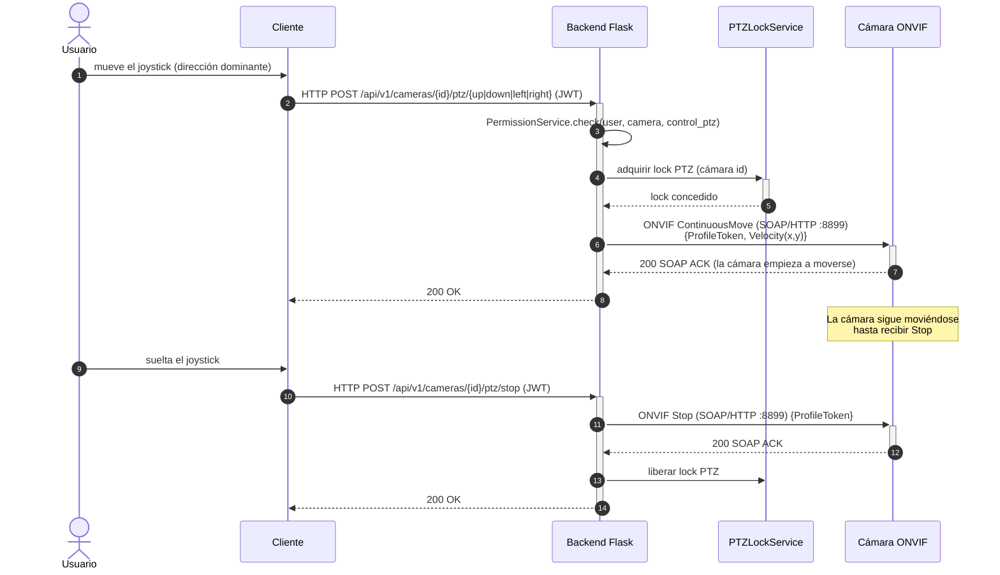

# Flujos de Secuencia — Operaciones Críticas del Ecosistema

> Documento de arquitectura / integración de sistemas. Diagramas de secuencia
> (Mermaid `sequenceDiagram`) y su transcripción textual para los tres flujos
> críticos:
>
> 1. **Descubrimiento y Autenticación**
> 2. **Petición de Streaming en Vivo (Live View)**
> 3. **Control PTZ (Pan, Tilt, Zoom)**
>
> **Actores:** Cliente (App Móvil / App de Escritorio PySide6), Backend (Flask),
> go2rtc (sidecar de medios) y Cámara ONVIF (hardware).
>
> **Nota sobre la concurrencia (clave).** Flask atiende cada petición de forma
> **síncrona** en un hilo de su *pool* (`app.run(threaded=True)`): el hilo de la
> petición **se bloquea** hasta que termina la operación (p. ej. esperar el ACK
> SOAP de la cámara, o escuchar WS-Discovery). Por eso los clientes ejecutan las
> operaciones largas (descubrimiento) en su **propio hilo** (`QThread` en
> escritorio / *coroutine* en móvil) con *timeouts* HTTP amplios. El **vídeo NO
> atraviesa Flask**: el plano de medios lo gestiona **go2rtc** de forma
> independiente y asíncrona — así un servidor síncrono nunca queda bloqueado por
> un stream continuo.

---

## Flujo 1 — Descubrimiento y Autenticación

El cliente primero **autentica** (obtiene JWT) y luego solicita al backend
**descubrir** cámaras en la LAN. El backend usa **WS-Discovery (multicast)** y,
como respaldo, un **escaneo de subred**, sondeando cada candidato por ONVIF.

### 1.1 Diagrama de Secuencia

```mermaid
sequenceDiagram
    autonumber
    actor U as Usuario
    participant C as Cliente (Móvil/Escritorio)
    participant F as Backend Flask
    participant DB as PostgreSQL
    participant NET as Red LAN (multicast 3702)
    participant CAM as Cámara(s) ONVIF

    Note over C,F: AUTENTICACIÓN (síncrona, rápida)
    U->>C: introduce credenciales
    C->>+F: HTTP POST /api/v1/auth/login {username, password} (JSON)
    F->>+DB: verifica usuario + hash de contraseña
    DB-->>-F: usuario válido
    F-->>-C: 200 {access_token, refresh_token} (JWT)
    Note over C: Guarda el JWT; lo añade como<br/>Authorization: Bearer en cada petición

    Note over C,CAM: DESCUBRIMIENTO (largo; el cliente lo corre en su propio hilo)
    U->>C: pulsa "Descubrir cámaras"
    C->>+F: HTTP POST /api/v1/cameras/discover {timeout, subnet_scan} (JWT)
    Note over F: Hilo de la petición BLOQUEADO<br/>mientras escucha la red
    F->>NET: WS-Discovery Probe (SOAP sobre UDP multicast :3702)
    CAM-->>NET: ProbeMatch (XAddrs = URL device_service)
    NET-->>F: lista de XAddrs
    loop por cada cámara candidata
        F->>+CAM: ONVIF GetDeviceInformation / GetProfiles / GetStreamUri (SOAP/HTTP :8899)
        CAM-->>-F: fabricante, modelo, perfiles, URI RTSP
    end
    opt si multicast devuelve 0
        F->>CAM: escaneo de subred + sondeo ONVIF (fallback)
    end
    F-->>-C: 200 {data:[{ip, manufacturer, model, resolution, connection_type}]} (JSON)
    C-->>U: muestra cámaras encontradas (alcanzables / no alcanzables)
```

### 1.2 Secuencia Textual

**Autenticación**
1. El usuario introduce credenciales en el cliente.
2. **Cliente → Backend**: `HTTP POST /api/v1/auth/login` con *payload* **JSON**
   `{username, password}`.
3. **Backend → BD**: consulta el usuario y verifica el **hash** de la contraseña
   (SQLAlchemy). *(Flask bloquea el hilo de la petición durante la verificación.)*
4. **Backend → Cliente**: `200 OK` con **JWT** `{access_token, refresh_token}`.
5. El cliente persiste el JWT y lo enviará en la cabecera
   `Authorization: Bearer <token>` de todas las peticiones siguientes.

**Descubrimiento**
6. El usuario pulsa "Descubrir cámaras". El cliente lanza la petición en un
   **hilo propio** (`QThread`/coroutine) con *timeout* HTTP amplio (~180 s).
7. **Cliente → Backend**: `HTTP POST /api/v1/cameras/discover` (**JWT**) con
   `{timeout, subnet_scan}`.
8. **Backend → Red**: emite un **Probe de WS-Discovery** — mensaje **SOAP sobre
   UDP multicast** a `239.255.255.250:3702`. *(El hilo de la petición Flask queda
   bloqueado escuchando respuestas.)*
9. **Cámaras → Backend**: cada cámara responde con un **ProbeMatch** que incluye
   sus `XAddrs` (URL del `device_service` ONVIF).
10. **Backend → Cámara** (por cada candidata): peticiones **SOAP/HTTP** ONVIF
    (`GetDeviceInformation`, `GetProfiles`, `GetStreamUri`) al puerto `:8899`,
    autenticando con credenciales — obtiene fabricante, modelo, resolución y la
    **URI RTSP**.
11. **Fallback**: si el multicast no devuelve nada (firewall), el backend hace un
    **escaneo de la subred** y sondea ONVIF cada IP.
12. **Backend → Cliente**: `200 OK` con **JSON** `{data:[...]}`, separando cámaras
    **alcanzables** de **no alcanzables** (IP de otra subred).
13. El cliente muestra la lista para que el usuario las agregue.

---

## Flujo 2 — Petición de Streaming en Vivo (Live View)

> **Arquitectura real:** el backend **no transmite el vídeo**. La negociación
> ONVIF de la URI RTSP ocurre al **descubrir/agregar** la cámara (paso previo); en
> vivo, el backend solo entrega **URLs de go2rtc** (plano de control), y el
> cliente consume el vídeo **directamente de go2rtc** (plano de medios). go2rtc
> ingiere el RTSP de la cámara **una sola vez** y lo re-publica.

### 2.1 Diagrama de Secuencia

```mermaid
sequenceDiagram
    autonumber
    actor U as Usuario
    participant C as Cliente (WebRTC/VLC)
    participant F as Backend Flask
    participant G as go2rtc (sidecar)
    participant CAM as Cámara ONVIF

    Note over C,F: PLANO DE CONTROL (REST · síncrono · JWT)
    U->>C: abre "En vivo" de una cámara
    C->>+F: HTTP GET /api/v1/cameras/ (JWT)
    Note over F: Enriquece cada cámara con URLs de go2rtc<br/>(stream_url RTSP, hls_url, webrtc); la URI RTSP<br/>de la cámara ya se obtuvo por ONVIF al agregarla
    F-->>-C: 200 {cameras:[{hls_url, stream_url, webrtc_url, ...}]} (JSON)

    Note over C,CAM: PLANO DE MEDIOS (go2rtc · asíncrono · Flask NO participa)
    alt Móvil — WebRTC (baja latencia)
        C->>+G: WebSocket signaling: offer SDP (ws ://IP:1984/api/ws?src=cam_X)
        G->>+CAM: RTSP DESCRIBE/SETUP/PLAY (:554) — solo si no estaba ingiriendo
        CAM-->>-G: RTP (H.265, 1 sola conexión)
        G->>G: transcode HEVC→H264 (lente/calidad, QSV)
        G-->>-C: answer SDP + ICE; media WebRTC (UDP :8555, sub-segundo)
    else Escritorio — RTSP restream (libVLC)
        C->>+G: RTSP DESCRIBE/SETUP/PLAY (:8554/cam_X)
        G-->>-C: RTP del restream (flujo continuo)
    end
    Note over C,G: El stream es continuo y vive fuera de Flask
```

### 2.2 Secuencia Textual

**Plano de control (REST, síncrono)**
1. El usuario abre la vista "En vivo" de una cámara.
2. **Cliente → Backend**: `HTTP GET /api/v1/cameras/` (**JWT**).
3. **Backend**: para cada cámara, **enriquece** la respuesta con las **URLs de
   go2rtc** (`stream_url` RTSP, `hls_url`, `webrtc_url`). *(La **URI RTSP** real de
   la cámara se obtuvo por **ONVIF `GetStreamUri`** al descubrir/agregar la cámara,
   no en cada petición de vídeo.)*
4. **Backend → Cliente**: `200 OK` con **JSON** que incluye las URLs de streaming.

**Plano de medios (go2rtc, asíncrono — Flask no participa)**
5. **Móvil (WebRTC):** el cliente deriva `ws://IP:1984/api/ws?src=cam_X` y abre un
   **WebSocket de signaling** enviando su **offer SDP**.
6. **go2rtc → Cámara**: si aún no la estaba ingiriendo, abre **RTSP**
   (`DESCRIBE/SETUP/PLAY`, `:554`) — **una única conexión** a la cámara.
7. **Cámara → go2rtc**: paquetes **RTP** con vídeo **H.265**.
8. **go2rtc**: **transcodifica** HEVC→H264 (por lente/calidad, acelerado por QSV).
9. **go2rtc → Cliente**: responde con **answer SDP** + candidatos **ICE** y entrega
   el **media WebRTC** por **UDP `:8555`** (latencia sub-segundo). El flujo es
   continuo y asíncrono.
10. **Escritorio (RTSP):** alternativamente, el cliente reproduce con **libVLC**
    desde el **restream RTSP** de go2rtc (`:8554/cam_X`); go2rtc reutiliza la misma
    ingesta de la cámara.

> **Reproducción de grabaciones (VOD)** — variante: el cliente pide
> `GET /api/v1/recordings/...` (JWT), el backend devuelve una **URL firmada (HMAC)**
> y el reproductor descarga el `.mp4` con soporte `Range`, **sin** enviar el JWT.

---

## Flujo 3 — Control PTZ (Pan, Tilt, Zoom)

El usuario manipula el joystick/controles; el cliente envía la **dirección** al
backend, que adquiere un **lock**, traduce la orden a **ONVIF `ContinuousMove`**
(SOAP) y la envía a la cámara. Al soltar, se envía `stop`.

### 3.1 Diagrama de Secuencia



### 3.2 Secuencia Textual

1. El usuario mueve el joystick; el cliente calcula la **dirección dominante**
   (al cruzar la zona muerta) y la envía.
2. **Cliente → Backend**: `HTTP POST /api/v1/cameras/{id}/ptz/{direction}`
   (**JWT**), con `direction ∈ {up, down, left, right}`.
3. **Backend**: verifica permiso con `PermissionService` (`control_ptz`).
4. **Backend → PTZLockService**: adquiere un **lock por cámara** (evita comandos
   concurrentes de varios usuarios). *(El hilo de la petición Flask procede de
   forma síncrona.)*
5. **Backend → Cámara**: traduce la dirección a **ONVIF `ContinuousMove`** —
   petición **SOAP/HTTP** (`:8899`) con `{ProfileToken, Velocity(x, y)}` (vector de
   velocidad *pan/tilt*; *zoom* análogo).
6. **Cámara → Backend**: `200` **ACK SOAP**; la cámara **inicia el movimiento** y
   **continúa** hasta recibir un `Stop`.
7. **Backend → Cliente**: `200 OK`.
8. El usuario **suelta** el joystick.
9. **Cliente → Backend**: `HTTP POST /api/v1/cameras/{id}/ptz/stop` (**JWT**).
10. **Backend → Cámara**: **ONVIF `Stop`** (SOAP/HTTP) con `{ProfileToken}`.
11. **Cámara → Backend**: `200` ACK SOAP (detiene el movimiento).
12. **Backend → PTZLockService**: **libera** el lock.
13. **Backend → Cliente**: `200 OK`.

> **Rigor de concurrencia:** cada `POST` PTZ es **síncrono** — Flask bloquea el
> hilo de la petición hasta el ACK SOAP de la cámara (operación de milisegundos en
> LAN). El **lock** serializa el acceso al subsistema PTZ de la cámara; el patrón
> *move-on-press / stop-on-release* mantiene el control fluido sin saturar la
> cámara con comandos por cada píxel de desplazamiento.

---

## Apéndice — Puertos y Protocolos por Flujo

| Flujo | Cliente ↔ Backend | Backend ↔ Cámara | Cliente ↔ go2rtc |
|---|---|---|---|
| Descubrimiento/Auth | HTTP REST + JWT (`:5000`) | WS-Discovery UDP (`:3702`) + ONVIF SOAP (`:8899`) | — |
| Live View | HTTP REST + JWT (`:5000`) | *(ONVIF `GetStreamUri` al agregar)* | WebRTC (`:1984` ws + `:8555` UDP) / RTSP (`:8554`) |
| PTZ | HTTP REST + JWT (`:5000`) | ONVIF `ContinuousMove`/`Stop` SOAP (`:8899`) | — |

*Documentos relacionados:* [`ARQUITECTURA.md`](ARQUITECTURA.md) ·
[`PIPELINE_FRAME.md`](PIPELINE_FRAME.md) · [`COMPARATIVA_TECNOLOGICA.md`](COMPARATIVA_TECNOLOGICA.md)
