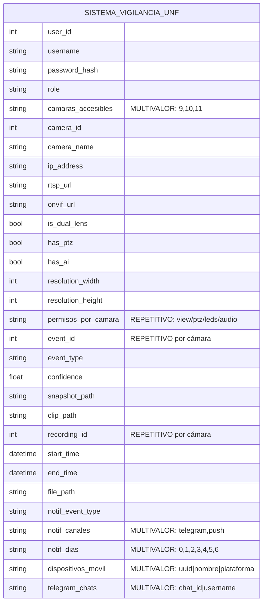
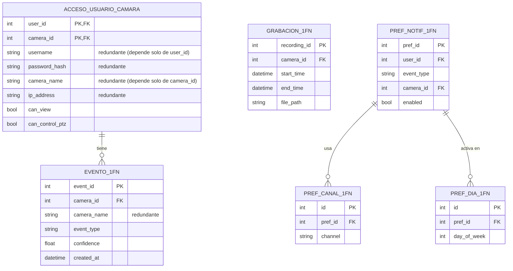
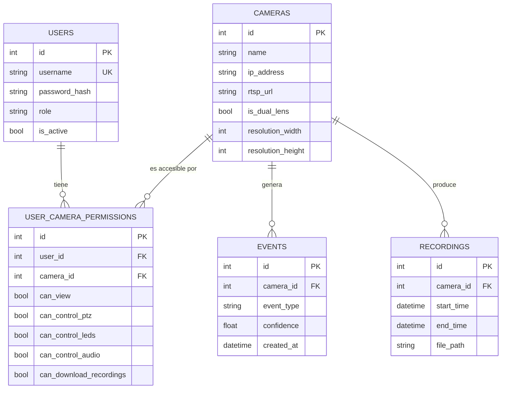
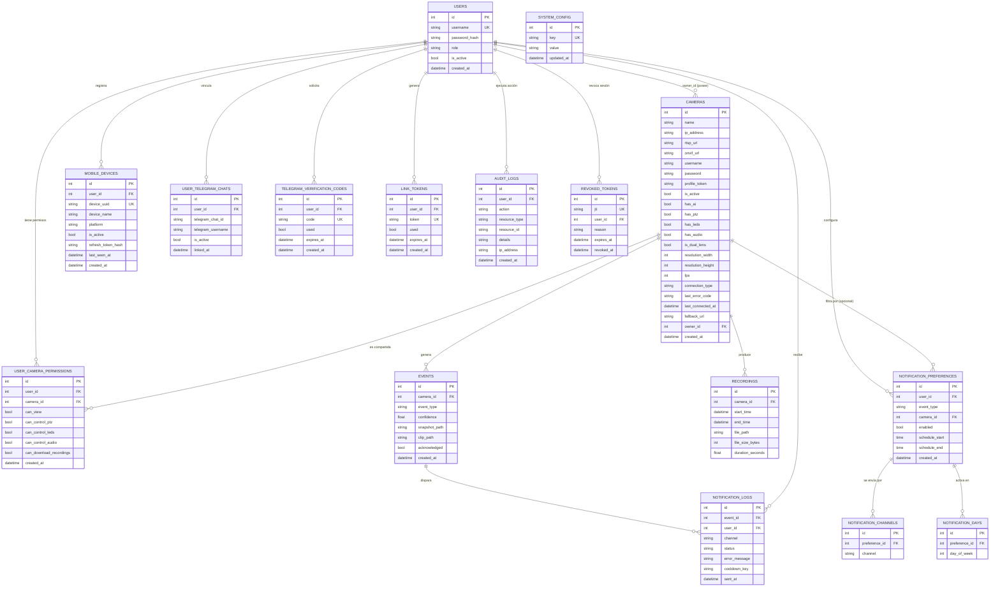

# Normalización de la Base de Datos (0FN → 3FN)

> Documento de diseño de base de datos del sistema de videovigilancia (NVR/VMS).
> Describe el proceso de normalización desde la **forma no normalizada (0FN)** hasta
> la **Tercera Forma Normal (3FN)**, que es el estado actual del esquema
> (PostgreSQL + SQLAlchemy 2.0). Incluye, para cada etapa: el diagrama
> entidad-relación en Mermaid, los cambios aplicados, las anomalías que se
> eliminaron, el propósito de cada tabla, los módulos del backend que la consumen,
> la cardinalidad de cada relación y la justificación (defensa) de la 3FN.

---

## 0. Notación y leyenda

**Formas normales (resumen):**
- **0FN / UNF (no normalizada):** hay grupos repetitivos y atributos multivaluados
  (listas dentro de una celda).
- **1FN:** todos los atributos son **atómicos**; sin grupos repetitivos; existe una
  clave primaria.
- **2FN:** está en 1FN y **no hay dependencias parciales** (ningún atributo depende
  de *parte* de una clave compuesta).
- **3FN:** está en 2FN y **no hay dependencias transitivas** (ningún atributo no
  clave depende de otro atributo no clave).

**Cardinalidad (notación "crow's foot" de Mermaid):**

| Símbolo | Significado |
|---|---|
| `||--||` | uno a uno (1:1) |
| `||--o{` | uno a muchos (1:N) — el lado `o{` es "cero o muchos" |
| `||--|{` | uno a muchos (1:N) — el lado `|{` es "uno o muchos" (obligatorio) |
| `}o--o{` | muchos a muchos (N:M) |
| `PK` | clave primaria · `FK` clave foránea · `UK` clave única |

---

## 1. 0FN — Forma No Normalizada (punto de partida)

En el diseño inicial, toda la información del sistema se concibe como **un único
registro plano** por cada "captura" del sistema: mezcla datos del usuario, de la
cámara, de cada evento, de cada grabación y de las preferencias de notificación, con
**atributos multivaluados** (listas separadas por comas) y **grupos repetitivos**
(un usuario tiene varias cámaras; una cámara tiene muchos eventos y grabaciones; una
preferencia tiene varios canales y varios días).

**Anomalías que provoca el 0FN:**
- **Inserción:** no se puede registrar una cámara sin un evento/usuario asociado en
  la misma fila; no se puede dar de alta una preferencia sin duplicar datos.
- **Actualización:** cambiar el `username` obliga a actualizarlo en **todas** las
  filas donde aparece (cada evento/grabación) → inconsistencias.
- **Eliminación:** borrar el último evento de una cámara podría **borrar también** los
  datos de la cámara.
- **Multivalor:** `camaras_accesibles`, `notif_canales`, `notif_dias` violan la
  atomicidad → imposible hacer JOIN, índices o integridad referencial sobre ellos.

---

## 2. 1FN — Atomicidad y eliminación de grupos repetitivos

**Cambios aplicados:**
1. Se eliminan los **atributos multivaluados**: cada valor de una lista pasa a ser
   una **fila** en una tabla propia (`camaras_accesibles`, `notif_canales`,
   `notif_dias`, `telegram_chats`, `dispositivos` → filas atómicas).
2. Se separan los **grupos repetitivos** (eventos, grabaciones) en filas
   individuales con su propia clave.
3. Se define una **clave primaria** en cada tabla.

Tras 1FN, los datos ya son atómicos, pero todavía coexisten en tablas amplias con
**redundancia** (los datos del usuario y de la cámara se repiten en cada fila de
acceso, evento, etc.) y con **claves compuestas**.

**Qué arregló 1FN:** atomicidad total (ya se pueden indexar/relacionar canales y
días); fin de los grupos repetitivos.
**Qué falta:** en `ACCESO_USUARIO_CAMARA` (clave compuesta `user_id`+`camera_id`)
hay **dependencias parciales** — `username` depende solo de `user_id` y `camera_name`
solo de `camera_id` → se resuelve en 2FN.

---

## 3. 2FN — Eliminación de dependencias parciales

**Cambios aplicados:**
1. Se separan las **entidades independientes** que estaban mezcladas en las tablas de
   clave compuesta: nacen **`users`** y **`cameras`** como tablas propias.
2. La tabla de acceso se convierte en una **tabla puente (junction)**
   `user_camera_permissions` que conserva **solo** los atributos que dependen de la
   clave **completa** (`user_id` + `camera_id`): los permisos.
3. `events` y `recordings` quedan como entidades que dependen de su propia clave y
   referencian a `cameras` por FK (sin copiar `camera_name`).

**Qué arregló 2FN:** desaparece la redundancia de datos de usuario/cámara; cada
atributo depende de la **clave completa** de su tabla; la relación N:M usuario↔cámara
queda modelada correctamente con la tabla puente.
**Qué falta:** eliminar **dependencias transitivas** (atributos no clave que dependen
de otros atributos no clave) y separar los conjuntos secundarios (canales, días) y las
tablas de soporte → 3FN.

---

## 4. 3FN — Eliminación de dependencias transitivas (estado ACTUAL)

**Cambios aplicados:**
1. **Sin atributos derivados/transitivos**: en `events`/`recordings` se guarda solo
   `camera_id` (FK), nunca `camera_name` (que dependería transitivamente de
   `camera_id`). El nombre se obtiene por JOIN.
2. Los **canales** y **días** de notificación se modelan en **tablas hijas**
   (`notification_channels`, `notification_days`) dependientes de
   `notification_preferences` → cada atributo depende solo de su clave.
3. Se añaden las **entidades de soporte** (cada una con su clave y dependencias
   propias): `mobile_devices`, `user_telegram_chats`, `telegram_verification_codes`,
   `link_tokens`, `notification_logs`, `audit_logs`, `revoked_tokens`,
   `system_config`.
4. Integridad referencial explícita con `ON DELETE CASCADE`/`SET NULL`, claves únicas
   (`uq_user_camera`, `uq_user_event_camera`) e índices compuestos.

### 4.1 Diagrama ER completo (3FN — ESQUEMA TAL COMO ESTÁ IMPLEMENTADO HOY)

> Este diagrama refleja **exactamente** el esquema actual en producción (generado
> 1:1 desde `backend/app/database/models.py`): las 16 tablas reales, sus columnas y
> sus claves foráneas. **No es una versión idealizada**: se conservan las
> desnormalizaciones existentes (`recordings.duration_seconds`,
> `notification_logs.cooldown_key`), `system_config` aparece sin relación (como
> está) y **NO** incluye relaciones propuestas a futuro (p. ej. `events.recording_id`
> NO existe y por eso no aparece).

> Nota: `SYSTEM_CONFIG` aparece sin relación a propósito (ver §6): es una tabla de
> **parámetros globales clave-valor**, no una entidad de dominio.

---

## 5. Propósito de cada tabla y módulos que la consumen

| Tabla | Propósito | Módulos / componentes que la usan |
|---|---|---|
| **users** | Cuentas de usuario (admin/user), autenticación y autorización | `AuthService`, JWT, rutas `auth`/`users`, `PermissionService` |
| **cameras** | Cámaras IP ONVIF y sus capacidades/estado | `CameraManager`, `camera_service`, `Go2RtcManager`, ONVIF (PTZ/time/LED/discovery), rutas `cameras` |
| **user_camera_permissions** | Permisos granulares usuario↔cámara (N:M) | `PermissionService`, rutas `permissions` |
| **events** | Eventos/alertas de seguridad (persona, vehículo, movimiento, offline) | `AIScheduler`, `EventManager`, `EventService`, rutas `events`, `mobile` (historial) |
| **recordings** | Grabaciones continuas y clips de evento en disco | `RecordingManager`, `StorageManager`, `ConsistencyChecker`, rutas `recordings`, playback |
| **mobile_devices** | Dispositivos móviles vinculados (refresh token, WS) | `device_service`, rutas `devices`, onboarding QR, `ws_broker` |
| **notification_preferences** | Reglas de notificación por usuario/evento/cámara | `NotificationRouter`, rutas `notifications`, app `EventConfig` |
| **notification_channels** | Canales por preferencia (telegram, push) | `NotificationRouter`, `TelegramNotifier` |
| **notification_days** | Días de la semana activos por preferencia | `NotificationRouter` (ventana de envío) |
| **notification_logs** | Bitácora de envíos + control de cooldown (anti-spam) | `TelegramNotifier`, `NotificationRouter` |
| **user_telegram_chats** | Chats de Telegram vinculados a cada usuario | `TelegramNotifier`, `telegram_bot_poller`, rutas `telegram` |
| **telegram_verification_codes** | Códigos temporales de vinculación con Telegram | `qr_service`/`telegram`, rutas `telegram` |
| **link_tokens** | Tokens temporales para vincular móvil por QR | `qr_service`, rutas `devices`/`qr` |
| **audit_logs** | Auditoría de acciones sensibles (login, borrados, permisos) | Capa de auditoría / rutas administrativas |
| **revoked_tokens** | JWT revocados persistentes (blocklist rehidratable) | `JWT` blocklist, `auth` (logout/cambio de contraseña) |
| **system_config** | Parámetros globales clave-valor del sistema | `config.reload_runtime_config_from_db`, rutas `system`, Ajustes |

---

## 6. Defensa de la 3FN (justificación de diseño)

1. **Está en 3FN, no por casualidad.** Cada tabla tiene clave primaria, todos los
   atributos son atómicos (1FN), no hay dependencias parciales —se usan claves
   surrogadas de una sola columna y la única relación N:M se modela con tabla puente—
   (2FN), y no hay dependencias transitivas: los datos derivables (p. ej. el nombre de
   la cámara) **no se duplican**, se obtienen por JOIN vía FK (3FN).

2. **Multivalor correctamente normalizado.** Canales y días de notificación viven en
   **tablas hijas** (`notification_channels`, `notification_days`) en vez de listas
   separadas por comas → permiten integridad, índices y consultas.

3. **Integridad referencial real.** FKs con `ON DELETE CASCADE`/`SET NULL`, claves
   únicas (`uq_user_camera`, `uq_user_event_camera`, `username`, `device_uuid`, `jti`)
   e índices compuestos (`idx_event_camera_created`, `idx_recording_camera_time`,
   etc.). Esto es lo que caracteriza a un esquema relacional bien diseñado.

4. **Desnormalizaciones puntuales y JUSTIFICADAS** (no violan el espíritu de 3FN, son
   decisiones de ingeniería conscientes):
   - `recordings.duration_seconds`: derivable de `end_time - start_time`, pero se
     almacena para evitar recomputar en cada lectura y para cubrir grabaciones con
     `end_time` nulo o con huecos. Desnormalización barata y controlada.
   - `notification_logs.cooldown_key`: clave derivada precalculada para el lookup
     indexado del anti-spam.

5. **Tablas sin relación de dominio — a propósito.** `system_config` es un almacén
   **clave-valor** de parámetros globales (patrón estándar de configuración); por
   naturaleza no se relaciona con entidades de negocio. `audit_logs` y
   `revoked_tokens` son tablas **transversales** (auditoría / seguridad) que sí
   referencian a `users` pero no forman parte del grafo de dominio porque son
   infraestructura. **Que una tabla no tenga FK no la saca del modelo relacional**: en
   el modelo de Codd, "relación" = **tabla**; lo relacional lo da el modelo (tablas,
   claves, integridad, álgebra relacional), no que toda tabla esté unida a otra.

6. **Apropiada para la carga real.** Es un sistema OLTP de pocas cámaras; el cuello de
   botella es el vídeo (iGPU/IO), no la BD. A esta escala, **3FN es la elección
   correcta**: maximiza integridad sin penalizar el rendimiento (la optimización real
   son los índices, que ya existen). Desnormalizar aquí no aportaría velocidad y
   restaría integridad.

---

## 7. Resumen de relaciones y cardinalidad

| Relación | Cardinalidad | Regla de negocio |
|---|---|---|
| users → cameras (owner_id) | 1 : N | Un usuario posee varias cámaras; una cámara tiene un dueño (opcional) |
| users ↔ cameras (permissions) | N : M | Cámaras compartidas con permisos granulares (vía tabla puente) |
| cameras → events | 1 : N | Una cámara genera muchos eventos |
| cameras → recordings | 1 : N | Una cámara produce muchas grabaciones |
| users → notification_preferences | 1 : N | Un usuario define varias reglas |
| cameras → notification_preferences | 1 : N | Regla opcionalmente acotada a una cámara |
| notification_preferences → channels | 1 : N | Una regla por varios canales |
| notification_preferences → days | 1 : N | Una regla activa varios días |
| events → notification_logs | 1 : N | Un evento puede notificarse varias veces/canales |
| users → mobile_devices / telegram_chats / tokens / logs | 1 : N | Datos de soporte por usuario |

---

## 8. Conclusión

El esquema **parte conceptualmente de una forma 0FN** (registro plano con multivalor
y grupos repetitivos) y, aplicando atomicidad (1FN), eliminación de dependencias
parciales (2FN) y de dependencias transitivas (3FN), llega al **modelo actual en
Tercera Forma Normal**: 16 tablas, 15 de ellas relacionadas por claves foráneas en un
grafo coherente centrado en `users` y `cameras`, con integridad referencial, claves
únicas e índices. Las únicas desnormalizaciones (`duration_seconds`, `cooldown_key`)
son decisiones de ingeniería justificadas, y la única tabla sin relación de dominio
(`system_config`) lo es por su naturaleza de configuración clave-valor. Es, por tanto,
una base de datos **relacional y normalizada a 3FN**, defendible por diseño.

---

*Documentos relacionados:* [`ARQUITECTURA.md`](ARQUITECTURA.md) ·
[`STACK_TECNOLOGICO.md`](STACK_TECNOLOGICO.md)
