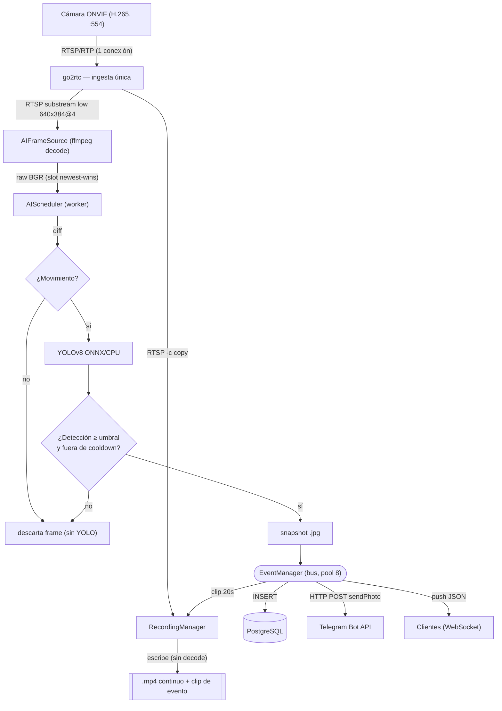

# Ciclo de Vida de un Frame — De la Cámara a Disco + Alerta de Telegram

> Documento de ingeniería de backend / streaming. Rastrea el recorrido de **un
> frame** desde su captura en la cámara ONVIF hasta sus **dos destinos finales
> simultáneos**: (A) **almacenamiento** (grabación en disco + registro en BD) y
> (B) **notificación de Telegram** cuando el frame dispara un evento (p. ej.
> detección de persona/vehículo gateada por movimiento).
>
> **Premisa arquitectónica clave (no obvia):** el frame **no se copia** a los dos
> destinos. **go2rtc** ingiere el RTSP de la cámara **una sola vez** y lo fan-out
> a **dos consumidores independientes**:
> 1. **Ruta de grabación** — `ffmpeg -c copy` (sin decodificar): el stream H.265
>    se escribe a `.mp4` tal cual (coste de CPU ~0).
> 2. **Ruta de IA** — un `ffmpeg` aparte **decodifica** un substream de baja
>    resolución (640×384 @4fps) para análisis. El frame decodificado de esta ruta
>    es el que dispara el evento y se convierte en el **snapshot** de la alerta.
>
> Ambas rutas comparten el **mismo origen temporal** (la misma cámara/escena), por
> eso el clip grabado y la alerta corresponden al mismo instante, aunque sean
> dos pipelines físicamente distintos. Documento relacionado:
> [`ARQUITECTURA.md`](ARQUITECTURA.md).

---

## 1. Diagrama de Flujo del Frame (Mermaid.js)

### 1.1 Secuencia con concurrencia (sequenceDiagram)

```mermaid
sequenceDiagram
    autonumber
    participant CAM as Cámara ONVIF
    participant G2R as go2rtc (Ingesta RTSP)
    participant REC as RecordingManager<br/>(ffmpeg -c copy)
    participant SRC as AIFrameSource<br/>(ffmpeg decode low)
    participant SCH as AIScheduler (worker thread)
    participant MOT as MotionDetector (OpenCV)
    participant YOLO as YOLOv8 (ONNX/CPU)
    participant BUS as EventManager<br/>(pool 8 hilos)
    participant DISK as Disco (.mp4 + .jpg)
    participant DB as PostgreSQL
    participant TG as Telegram Bot API
    participant WS as Clientes (WebSocket)

    CAM->>G2R: RTSP/RTP — H.265 (pull único, :554)

    rect rgb(20,40,60)
    note over G2R,DISK: RUTA A — Grabación (siempre activa, sin decodificar)
    G2R-->>REC: RTSP restream (:8554)
    REC->>DISK: escribe segmentos .mp4 (stream copy, ~0% CPU)
    end

    rect rgb(20,55,40)
    note over G2R,YOLO: RUTA B — Análisis (decodifica solo lo necesario)
    G2R-->>SRC: RTSP substream low (640x384 @4fps)
    SRC->>SRC: ffmpeg decode → raw BGR → slot (newest-wins)
    SCH->>SRC: lee último frame del slot
    SCH->>MOT: diff de movimiento (gate barato)
    MOT-->>SCH: hay_movimiento = true
    SCH->>YOLO: infer(frame 640, conf≥0.35)
    YOLO-->>SCH: detección {persona, bbox, score}
    SCH->>SCH: cooldown por clase OK
    SCH->>DISK: guarda snapshot .jpg (frame anotado)
    SCH->>BUS: publish(EventData) — NO bloqueante
    end

    rect rgb(60,40,20)
    note over BUS,WS: Fan-out asíncrono (cada suscriptor en su hilo del pool)
    par Persistencia
        BUS->>DB: EventService → INSERT events
    and Clip de evento
        BUS->>REC: solicita clip 20s (pre/post 10s)
        REC->>DISK: escribe .mp4 de evento (/events)
    and Notificación Telegram
        BUS->>TG: HTTP POST sendPhoto (snapshot + caption)
    and Push tiempo real
        BUS->>WS: evento JSON (alerta in-app)
    end
    end

    note over SCH: El worker de IA continúa con el siguiente frame<br/>sin esperar a BD/Telegram/clip (desacoplado por el bus)
```



### 1.2 Fan-out del origen (flowchart TD)



---

## 2. Descripción del Pipeline (Paso a Paso)

### Fase 0 — Ingesta (una sola vez)
1. **Captura en la cámara.** La cámara ONVIF codifica la escena en **H.265 (HEVC)**
   y la publica por **RTSP/RTP** (`:554`). Es un *stream* continuo de paquetes RTP,
   no de "frames" individuales: los fotogramas viajan fragmentados y comprimidos
   inter-frame (GOP), por lo que un frame solo es decodificable a partir de su
   keyframe (I-frame).
2. **Ingesta por go2rtc.** El backend mantiene **una única conexión RTSP** a la
   cámara mediante el sidecar **go2rtc** (restricción del hardware: 1 sesión RTSP).
   go2rtc actúa de *fan-out*: re-publica el mismo origen a múltiples consumidores
   sin reabrir la cámara. A partir de aquí, las dos rutas son **pipelines
   independientes** que consumen de go2rtc.

### Fase A — Almacenamiento (ruta continua, sin decodificar)
3. **Grabación por copia de stream.** `RecordingManager` lanza un subproceso
   **`ffmpeg -c copy`** que lee el restream RTSP de go2rtc y escribe segmentos
   `.mp4` directamente. **No hay decodificación ni recodificación**: se copian los
   paquetes H.265 tal cual → coste de CPU/GPU prácticamente nulo y calidad nativa.
   Es un flujo **siempre activo** para la cámara monitorizada (la activación de IA
   arranca también la grabación continua).
4. **Persistencia del archivo.** Los segmentos se guardan en disco
   (`C:/nvr_data/recordings/<cam>/continuous/…`). El `RecordingManager` registra
   metadatos del fichero (ruta, inicio/fin, tamaño, duración) en la tabla
   `recordings`; `StorageManager` y `ConsistencyChecker` aplican cuota/retención y
   reconcilian disco↔BD en segundo plano.

### Fase B — Procesamiento / Análisis (ruta decodificada, gateada)
5. **Extracción del frame (decodificación selectiva).** `AIFrameSource` lanza un
   **`ffmpeg` propio** que pide a go2rtc un **substream de baja resolución**
   (640×384 @ ~4 fps) y lo **decodifica** a **frames crudos BGR**. Decodificar solo
   un substream ligero (no el 6 MP nativo) mantiene el coste de CPU bajo. Los
   frames se depositan en un **slot de "último frame gana" (newest-wins)**: si el
   análisis va por detrás, se **descartan** los frames intermedios en lugar de
   encolarlos (evita *backpressure* y latencia creciente).
6. **Lectura desacoplada.** `AIScheduler` corre en un **hilo worker dedicado**
   (no en el callback de captura — desacople deliberado para que la inferencia
   nunca bloquee la ingesta). Toma el frame **más reciente** del slot.
7. **Gate por movimiento (barato primero).** Antes de invocar el modelo, el frame
   pasa por `MotionDetector` (diferencia de fotogramas con **OpenCV**). Si no hay
   movimiento, el frame se **descarta sin ejecutar YOLO** — la operación cara solo
   se paga cuando hay algo que mirar.
8. **Inferencia YOLOv8.** Si hay movimiento, el frame (redimensionado a `imgsz=640`)
   se pasa a **YOLOv8 vía ONNX Runtime** (`CPUExecutionProvider`, umbral de
   confianza ~0.35). El modelo devuelve detecciones (clase, *bounding box*, score).
   Solo **una** cámara ejecuta IA a la vez (selector `AI_CAMERA_ID`).
9. **Decisión de evento + anti-spam.** Si hay una detección relevante (p. ej.
   `persona`) por encima del umbral **y** fuera del **cooldown por clase**, se
   confirma el evento. El cooldown evita inundar de alertas ante movimiento
   sostenido.
10. **Snapshot.** El frame que disparó el evento se serializa a **JPEG** y se
    guarda en disco; su ruta (`snapshot_path`) será la imagen de la alerta.
    *(Nota: el snapshot proviene del substream de IA → resolución modesta; el clip
    de vídeo asociado sí es de calidad nativa.)*

### Fase C — Fan-out del evento (almacenamiento + notificación, concurrentes)
11. **Publicación en el bus (no bloqueante).** `AIScheduler` llama a
    `EventManager.publish(EventData)` y **retorna de inmediato** para seguir con el
    siguiente frame. `EventData` lleva: `camera_id`, `event_type`, `confidence`,
    `snapshot_path`, timestamp.
12. **Despacho concurrente.** `EventManager` entrega el evento a sus suscriptores
    sobre un **pool de 8 hilos** (`_executor`), de modo que **ningún suscriptor
    bloquea a otro** ni al hilo de IA. En paralelo:
    - **Persistencia** — `EventService` ejecuta `INSERT` en `events` (PostgreSQL).
    - **Clip de evento** — se solicita a `RecordingManager` un **clip de 20 s**
      (10 s pre + 10 s post) que se escribe en `…/events/` (referido al mismo
      instante que ya se está grabando en continuo).
    - **Notificación Telegram** — `TelegramNotifier` construye el *payload*
      (imagen del snapshot + *caption* con cámara/tipo/hora) y hace **HTTP POST
      `sendPhoto`** a `api.telegram.org`, **respetando las `NotificationPreference`
      del usuario** (tipo de evento, cámara, horario) vía `NotificationRouter`.
    - **Push en vivo** — `ws_broker` emite el evento como **JSON por WebSocket**
      a las apps móvil/escritorio conectadas.
13. **Aislamiento de fallos y E/S.** Las llamadas de red (Telegram) y de BD corren
    en hilos del pool; un fallo o lentitud de Telegram (timeout, red caída) **no
    detiene** la grabación, la persistencia ni el análisis — cada rama es
    independiente y *best-effort*. El hilo de IA, mientras tanto, ya está
    procesando frames nuevos.

---

## 3. Notas de Rendimiento y Concurrencia

- **Decodificar lo mínimo:** grabación por `-c copy` (cero decode) + IA sobre un
  substream 640×384@4 fps. El frame de 6 MP nunca se decodifica en el camino
  caliente, lo que mantiene baja la CPU y libera la iGPU para los transcodes de
  directo.
- **Gate barato → modelo caro:** OpenCV (diff) actúa de filtro previo a YOLO; el
  modelo solo se ejecuta cuando hay movimiento, reduciendo drásticamente la carga
  media de inferencia.
- **Newest-wins (sin colas):** el slot de frames descarta los atrasados en vez de
  acumularlos → la latencia de detección no crece aunque haya picos de CPU.
- **Desacople por hilos:** captura (ffmpeg) ↔ análisis (`AIScheduler` worker) ↔
  efectos (pool de 8 hilos del `EventManager`) están separados; el camino de
  captura/inferencia **nunca** espera a disco, BD ni Telegram.
- **Idempotencia/anti-spam:** cooldown por clase en el `AIScheduler` y reglas de
  `NotificationPreference` evitan tormentas de alertas y POSTs redundantes a
  Telegram.
- **Una cámara con IA a la vez:** `AI_CAMERA_ID` acota el coste de inferencia a un
  único pipeline YOLO (decisión de capacidad para una sola máquina LAN).
```
